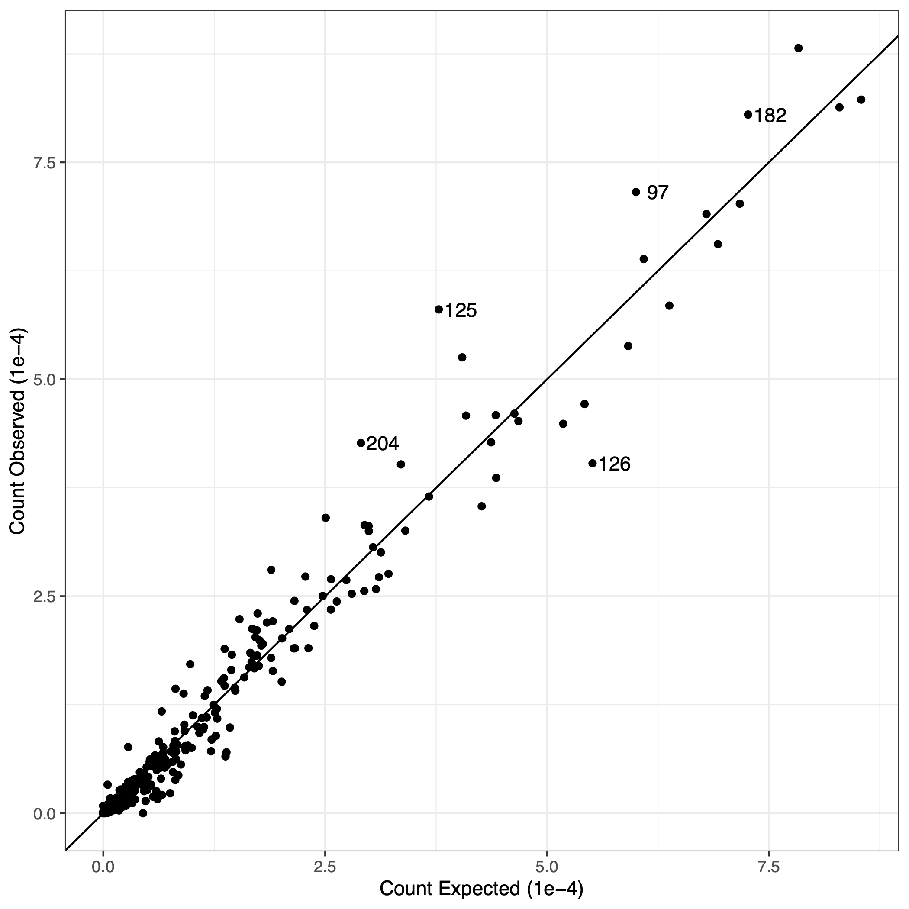

```{r setup, include = FALSE}
library(knitr); 
library(magrittr)
library(tidyverse)
library(tidybayes)
library(rstan)
library(loo)
library(patchwork)
library(ggrepel)
library(janitor)
library(scales)
library(geomtextpath)

theme_set(theme_bw())
```

```{r load_data, include=FALSE}

spawners <- read.csv("../../../okanagan_data/2025-04-07 Draft/Spawn Timing Data/spawn_timing.csv") %>% 
  mutate(date = as.Date(date), year = year(date), yday = yday(date))

index_sk <- spawners %>% 
  mutate(duplicate = duplicated(.)) %>% 
  filter(duplicate==FALSE) %>% 
  group_by(location, year, yday, date) %>% 
  filter(location == "Index") %>% 
  filter(species == "sk") %>% 
  summarise(
    live = if (all(is.na(live))) NA_real_ else sum(live, na.rm = TRUE),
    dead = if (all(is.na(dead))) NA_real_ else sum(dead, na.rm = TRUE)) %>% 
  arrange(date) %>% 
  ungroup() %>% 
  mutate(day_ind = as.numeric(factor(yday)), 
         year_ind = as.numeric(factor(year))) %>% 
  filter(!is.na(live)) 

index_sk %>% 
  ggplot(aes(x = yday, y = live, color = location))+
  geom_point()+
  facet_wrap(~year)
```

```{r trad_AUC, include = FALSE}
trad_AUC <- index_sk %>%            
  group_by(year) %>%   
  mutate(tdiff = date - lag(date),                      
         tdiff = replace(tdiff, which(tdiff < 0), NA),
         xbar = (live + lag(live))/2, 
         fishdays = case_when(                          
           is.na(xbar) ~ live * 11/2,         
           !is.na(xbar) ~ as.numeric(tdiff) * xbar
         ),
         cumulative = collapse::fcumsum(fishdays)) %>%  
  group_by(year) %>%     
  summarise(total_auc = max(cumulative, na.rm = TRUE) +
              (live[which.max(date)]*(11/2)), #this adds in the right tail.
            nerkids = round(total_auc/11,0))
```

```{r stan, include = FALSE}
priors <- data.frame(prior = c("log_runs_mu", "arrival_mu", "arrival_sigma", "spread","spread_sigma","residence", "count_dispersion"),
                     v1 = c(10,280-240, 0,log(8-1), 0,log(11-1), 1), 
                     v2 = c(1,5,2,0.2, 10, 0.3, 0.2))


sp_dat = list(n_priors = nrow(priors), 
              priors = data.matrix(priors[,-1]),
              n_years = max(index_sk$year_ind),
              year = as.numeric(factor(index_sk$year)),
              day = index_sk$yday-240,
              n_obs = nrow(index_sk),
              live_counts = index_sk$live)


stan_file <- "./stan/spawners.stan"
fit_file <- "./model_fits/spawner_m.RData"
hash_file <- "./model_fits/spawner_m.md5"

# Compute current hash
current_hash <- unname(tools::md5sum(stan_file))

# Check conditions and fit model if needed
if(!file.exists(fit_file) || !file.exists(hash_file) || 
   readLines(hash_file) != current_hash) {
  
  message("Compiling and fitting Stan model...")
  m <- stan_model(file = stan_file)
  fit <- sampling(mod, data = sp_dat, chains = 4, cores = 4)
  
  save(fit, m, file = fit_file)
  writeLines(current_hash, hash_file)
  
} else {
  message("Loading previously saved fit...")
  load(fit_file)
}

#model checks####
worst_Rhat <- summary(fit)$summary %>% 
  as.data.frame() %>% 
  mutate(Rhat = round(Rhat, 3)) %>% 
  arrange(desc(Rhat))

worst_Rhat %>% 
  filter(n_eff>3) %>% 
  ggplot(aes(x = n_eff, y = Rhat))+
  geom_point()+
  geom_hline(yintercept = 1.01, lty = 2)+
  geom_vline(xintercept = 400, lty = 2)

post <- extract(fit)
```

# Introduction

## The importance of spawner surveys

Spawner abundance is a key variable in salmon ecology. Functions relating spawners to their offspring that return as adults ("stock" and "recruits") are fundamental for management of salmon fisheries and salmon habitats [@ricker1975; @hilborn1992].

Estimates of the number of Sockeye Salmon (*Oncorhynchus nerka* Walbaum 1792) spawners in a river or a lake beach involve repeated surveys during the spawning period. Methods vary; conventionally: visual counts while boating, snorkeling, walking, or flying in a helicopter or small airplane; and recently, analyzing video from drones. There are many other methods to estimate spawner abundance: mark-recapture, conductivity sensors, conductivity sensors, counting fences, eDNA, and combinations of methods. Complications include distinguishing hatchery fish from wild, and separating anadromous Sockeye from non-anadromous Kokanee (sub-species of *O. nerka*).

## AUC: area under the curve

The conventional analysis of a survey of sockeye spawners determines **AUC**, the integral of spawner count over a number of surveys (units: fish$\times$days). Spawners have a **residence** time on spawning grounds (aka, survey life), so a spawner will be observed more than once in a series of surveys. The estimate for abundance of spawners divides AUC by residence to correct for repeated observations. That estimate of abundance is then proportional to 1/residence. Using an assumed value for residence time changes the absolute number of spawners in each survey to an index of relative abundance @askey2023. There are two approaches to estimating AUC:

1.  **non-parametric**: where "curve" means a trapezoid of linear interpolations of counts between survey dates [@english1992; @irvine1992;]. Prior knowledge about first and last presence of spawners (assumed dates for bounding zeros) is required. This is a robust estimator (ref?) and efforts have been made to estimate the precision of AUC from precision of observations [@askey2023; @korman2002; @millar2012; @parken2003; @parsons2010]. Essentially, AUC determines the maximum of a cumulative probability distribution of spawner number estimated by linear segments.
2.  **parametric**: a probability density distribution, typically Gaussian, is fitted to the time series of survey estimates in a year @hilborn1999. This has been extended by multi-level regression to analyze multiple years simultaneously [@adkison2001; @labelle2021; @su2001]. Then AUC is the area under that curve. Additional parameters and different distributions can provide truncated, skewed, or flattened variants.

Both require an assumed value for residence to estimate spawner abundance. Estimates for residence are determined independently of spawner surveys, using methods such as a spawner fence or recapture of fish (after death) tagged upon entry [@askey2023; @berghe1986; @cormack1964; @fukushima1997; @korman2002; @lady1998; @liao1994; @manske2000; @neilson1981; @perrin1990; @semenchenko1993; @zaporozhets2021]. also @bue1998 and @english1992 and @thomason1984.

## Objectives

An advance from AUC by a new model will estimate **residence** directly, as well as **timing** (mean day) and **spread** (standard deviation) of spawner entry. This will improve accuracy of **run** estimates (spawner abundance) and yield precisions for those estimates. Analyzing multiple years of surveys simultaneously will provide annual estimates of parameters, improved by using groups in a multilevel regression.

# Background

Our analysis was confined to the population of wild Sockeye Salmon that spawn in October and November in the Okanagan River (@fig-map) upstream of Osoyoos Lake. After emerging from spawning gravel, mid-April to mid-May, they spend one or two summers (rarely three) as parr in the North Basin of Osoyoos Lake before an ontological shift (near autumnal equinox) to pre-smolts and subsequent migration the following spring as smolts through the reservoirs (with abundant predators), spillways, and smolt passage tunnels of ten hydroelectric dams to reach the Pacific Ocean via the Columbia River.

After one to three years (rarely more) of marine growth, adults return to the Columbia River in late summer and attempt the transit of ten dams in a 950 km freshwater migration, before entering Osoyoos Lake and subsequently spawning yet further upstream. Ascending the Okanagan River from the Columbia River is increasingly compromised by high river temperatures [@isaak2011; @hyatt2020; @bailey2023; @martins2012; @major1967; @quinn1996].

{#fig-map fig-align="center" width="5in"}

# Data

Surveys of live and newly dead spawner were conducted with a consistent method 2000-2024, with 9 to 19 surveys per year spanning Julian days 240 to 328.

### Survey methods

JLT, SVP. Survey methods and dataset preparations are those of REFERENCE.

### problems re dead counts

JLT, SVP. I think our adventure from undocumented (?) survey methods is a valuable warning.

# Methods

## Problem: residence time

Spawners reside on spawning ground between repeated surveys, so a spawner may be counted repeatedly. The conventional estimate of abundance uses a value of residence to correct AUC for repeated observations of spawners. Residence is an assumed value, however, derived independently of spawner surveys. Can we do better?

## Solution: spawner entry and exit

The timing and spread of spawners' entry to a spawning ground is reasonably modeled as a Gaussian (normal) probability density distribution (PDD). If residence is constant (ignoring sex, age, size, condition, injury, history, and genetics), then the PDD of spawner exits is the same as the PDD of entry, just delayed. The number of live spawners in a survey day is then the cumulative distribution of entries to that day minus the cumulative distribution of exits. This model is sufficient to estimate runs and residence simultaneously, but assumes all spawners are identical. In what follows, the assumption of fixed residence is relaxed to allow exit spread differ from entry spread. for a distribution of residence times, but the model is still based on the assumption that all spawners are identical.

If available, counts of newly dead spawners provide further information to estimate residence. Newly dead spawners accumulate between surveys, so the counts depend on survey intervals: the number of newly dead spawners is exits (deaths) cumulative to this survey day, minus deaths cumulative to the preceding survey. This assumes that dead spawners are marked by tags, by cutting off tails, or "dead pitch" (removal from the river bank) to ensure they are only counted once. Some dead spawners will drift away, not counted, necessitating a factor to estimate fraction of dead observed.

## Model

An annual run of spawners enters a spawning ground with a Gaussian pattern for cumulative entry by day. They reside there for some days of spawning activity. Then spawner exits have the same distribution as entry, but lagged by residence. From this, the number of live spawners present on a survey day ( @fig-enterexit ) is\
$$
\begin{aligned}
\text{live}_\text{true}[t] &= run \ \big( entered - exited) \\
&= run \ \big(\int_0^t\mathcal{N}(t,\mu,\sigma) \text{d}t - \int_0^t\mathcal{N}(t,\mu+\lambda,\sigma) \text{d}t \big) \\
&= run \ \big(\text{pnorm}(t,μ,σ) -\text{pnorm}(t,μ+\lambda,σ)\big)
\end{aligned}
$$\
with $run$: spawner abundance (run size), $t$: survey day of the year, $\mu$: timing, $\sigma$: spread, $\lambda$: residence, and pnorm: the R function for cumulative Gaussian.

The resulting temporal pattern for number of spawners present is close to a simple Gaussian when $\lambda < 4\sigma$ (exit overlaps entry) but platykurtic (flat-topped) for protracted residence. Additional parameters for skew and kurtosis could be used in the entry and exit pattern.

```{r enterexit, echo=FALSE, , warning=FALSE, message=FALSE, fig.height = 4, fig.width = 6, fig.align= "centre", fig.cap = "The number of spawners present each day is the difference between accumulated entries and accumulated exits. From abundance: 100,000, timing: day 282, spread: 7days, residence: 10 days. Note peak count lags mean timing of entry. The integral of spawners present is the conventional AUC before correction by an assumed value for residence."}
j <- 25 # used 2024 as example
arrived <- sapply(15:max(sp_dat$day), FUN = function(x) {
  pnorm(x, post$arrival[,j], post$arrival_spread[,j]) * exp(post$log_run[,j])
}) %>% 
  as_tibble() %>%
  mutate(draw = row_number()) %>%
  pivot_longer(-draw, names_to = "day", values_to = "spawners") %>%
  mutate(day = as.integer(gsub("V", "", day)) + 14) %>% 
  mutate(type = "arrived")

dead <- sapply(15:max(sp_dat$day), FUN = function(x) {
  pnorm(x, post$arrival[,j] + post$residence, post$death_spread[,j]) * exp(post$log_run[,j])
}) %>% 
  as_tibble() %>%
  mutate(draw = row_number()) %>%
  pivot_longer(-draw, names_to = "day", values_to = "spawners") %>%
  mutate(day = as.integer(gsub("V", "", day))+14) %>% 
  mutate(type = "newly dead")

counts <- sapply(15:max(sp_dat$day), FUN = function(x) {
  entered <- pnorm(x, post$arrival[,j], post$arrival_spread[,j])
  exited <- pnorm(x, post$arrival[,j] + post$residence, post$death_spread[,j])
  
  exp(post$log_run[,j] + log(entered - (entered * exited)))
}) %>% 
  as_tibble() %>%
  mutate(draw = row_number()) %>%
  pivot_longer(-draw, names_to = "day", values_to = "spawners") %>%
  mutate(day = as.integer(gsub("V", "", day)) + 14) %>% 
  mutate(type = "present")

example_data <- bind_rows(arrived, dead, counts) %>% 
  group_by(type, day) %>% 
  summarise(l89 = quantile(spawners, probs = 0.065), 
            u89 = quantile(spawners, probs = 0.945),
            spawners = median(spawners))

mean_arrival_day <- median(post$arrival[,j])
median_residence <- median(post$residence)
y_value <- median(pnorm(mean_arrival_day, post$arrival[,j], post$arrival_spread[,j]) * exp(post$log_run[,j]))
x_start <- mean_arrival_day + 240
x_end <- mean_arrival_day + median_residence + 240

residence_df <- data.frame(
  x = x_start,
  xend = x_end,
  y = y_value,
  yend = y_value,
  label = "residence"
)

ggplot(example_data, aes(x = day + 240, y = spawners, group = type))+
  geom_textline(size = 4, linewidth = 1, aes(label = type), hjust = 0.65, family = "sans") +
  scale_x_continuous(labels = ~ format(as.Date(.x, origin = "2023-12-31"), "%b ") %>% 
                       paste0(as.integer(format(as.Date(.x, origin = "2023-12-31"), "%d"))),
                     breaks = as.numeric(as.Date(c("2024-09-15", "2024-10-01", "2024-10-15", "2024-11-01", "2024-11-15")) - as.Date("2023-12-31")), 
                     name = "", expand = c(0, 0))+
  scale_y_continuous(labels = label_number(scale = 1e-3, suffix = "k"), name = "Spawners (thousands)", expand = expansion(mult = c(0, 0.075)))+
  geom_textsegment(data = residence_df, aes(x = x_start, xend = x_end, y = y_value, yend = y_value, label = "residence"), linewidth = 0.5, inherit.aes = FALSE, size = 2.8, family = "sans")+
  annotate("text",
           x = Inf,
           y = max(example_data$spawners),  
           label = "total abundance",
           hjust = 1.03,
           vjust = -0.3,
           size = 4,
           family = "sans")+
  theme(panel.grid = element_blank())


```

Counts of newly dead (@fig-newlydead) depend on survey intervals: exits (deaths) cumulative to some survey day, minus exits cumulative to the preceding survey,\
$$
\text{dead}_{[t+n]} = run \cdot \phi \cdot \int_{t}^{t+n}\mathcal{N}(t,\mu +\lambda,\sigma) \ \text{d}t
$$ with $\phi$: the fraction of dead observed, and $t$ and $t+n$: dates for consecutive surveys separated by $n$ days. The first survey of dead spawners in a year observes an accumulation over an unlimited preceding interval; a small number or zero if surveys bracket spawning. The fraction of dead observed $(\phi)$ is likely to change within and between surveys, perhaps from varying flow. We note the potential for bias if $\phi$ varies by type of spawner (age, sex) when dead spawners are the source of biometrics data.


The model parameters are further described in the simulation model (Supplementary), including prior distributions and parameters discovered as analysis progressed.

## Simulations

We challenged this model with simulated observations to ensure robust and reliable results. Parameters were sampled randomly from prior PDDs. Simulated surveys were deliberately poor: the number of surveys each year was random uniform between 6 and 10, and survey dates within years random uniform but separated by at least 1 day. The resulting "true" data, but with multiplicative normal sampling error (% accuracy), was the "observed" data subsequently fitted by the multi-level regression coded in Stan. The scenarios explored fits (see Stan Model) with and without surveys of newly dead spawners. Despite noisy observations and gaps between surveys, parameters were recovered accurately from Stan model, with the caveat that the model used to fit the simulated data was the model that created it. Specifically, this procedure correctly estimated residence over a wide range. The simulations also generated indices of relative abundance of spawners, such as AUC as Gaussian and as linear interpolations (a trapezoid), peak live, and peak live puls dead (PLD). These were compared to the fitted run size to indicate reliability.

## Stan Models

We used the Stan programming language [@stan] to code series of increasingly complicated series of non-linear, mult-level Bayesian regressions to challenge this model with data. We explored which parameters were important and the trade-off of complication with precision. Our initial fits used explicit and tightly bounded prior PDD (informed priors), and initiated Monte Carlo sampling chains with parameter estimates derived from the data, but this was not necessary, the default procedures successfully initiated sampling chains. See Supplementary Materials for the Stan code that fits these models, plus the R code run it. includes this code, and details regarding convergence and model comparisons.

The individual models are described in @tbl-models .

```{r}
#| label: tbl-models
#| echo: false
#| tbl-cap: A series of increasingly complicated models were compared.
a <- read.csv('tables/model_comparisons.csv')
kable(a)
```

> outline: describe the different multi-level Stan models (which, why) details of Stan models: how and why: priors, inits, convergence,

### Likelihood Model

JLT, please. About sampling negative binomial residuals to fit. Compared to lognormal:\
target \<- normal_lpdf(log_run_predicted\|log_run_predicted, residuals)

The observed (dependent) variable, $y_{obs}$, is predicted, $y_{pred}$, by a sample of the parameters from the chosen model. An assumed PDD for the residuals, $y_{pred} -y_{obs}$, provides the likelihood of each observation given the model and a sample from its parameters space. There is a prior for the residuals PDD. That likelihood guides subsequent sampling to converge on a "best fit" multivariate PDD for the parameters @gelman2013.

### Diagnostics

An essential concept in Bayesian statistics is that the data is known but the best model for that data is unknown @mcelreath2016 and always a vast simplification of reality @jaynes2003. Metrics to compare and rank competing models are required. In ecological systems, a superabundance of habitat indicators as covariates means over-fitting is a problem. Leave-one-out (LOO) statistics[^1], where each point is predicted while omitted from fitting (cross-validations), provides diagnostics for over-fitting. We used **ELPD,** the sum of expected log predictive probability density for each of \$n\$ omitted observation's prediction, and $ELPD_{SE}=\text{sd}(ELPD)/\sqrt(n)$ the standard error of those probabilities @vehtari2017.

[^1]: see R package LOO <https://cran.r-project.org/web/packages/loo/loo.pdf> and LOO Package Glossary <https://mc-stan.org/loo/reference/loo-glossary.html>.

> We should also, please, report **p_loo**: the difference between elpd_loo and the non-cross-validated log posterior predictive density. It describes how much more difficult it is to predict future data than the observed data. ... `p_loo` can be interpreted as the *effective number of parameters*. Such as 25 non-independent (similar, well described by group PDD) estimates of entry_timing are effectively 15 (?) parameters. How crazy is that?!

# Results

> outline: Simulations recapture residence. why critical. Tables \* descriptions and fits (ELPD, AIC,) comparison of Stan models\
> \* parameter estimates and statistics for best model (so far).\
> Plots\
> \* example of model with CLs to entry and exit CPDs, observed datapoints, and CLs for predicted curve. Just one year. \* timing, spread, residence by years, with CLs. Fancier the better.

Based on ELPD statistics (@tbl-models) we selected SOMETHING as the best from those explored. Runs, entry_timing, entry_spread, and exit_spread were annual values in groups, with residence, residual, and deadFrac as single values.\

MORE!

## Runs

From the best model, the annual runs, with 50% and 96% uncertaintly limits are presented as @fig-runs. The fitted PDD for the runs group (by year, logged or not? ) was $\mathcal{N}(\mu= 9.5(sd?), \  \sigma= 1.07(sd?))$ , from which the 95% range, not logged, is 1,850 to 105,000 spawners. The precision of run estimates is approximately $\pm e^{1.07} = 1/3 \text{ to } 3 \times$.

```{r runs, echo = FALSE, warning=FALSE, message=FALSE, fig.cap="Posterior distributions of total spawning abundance by year (black) compared to the point estimate based on traditional trapezoidal AUC with an assumed 11 day residence (red). Points and error bars show the posterior median and the 66% and 95% credible intervals.", fig.align='center', fig.height=4, fig.width=7}
spread_draws(fit, log_run[year]) %>% 
  mutate(year = year + min(spawners$year)-1) %>% 
  ggplot(aes(x = year, y = exp(log_run)))+
  stat_pointinterval(aes(color = "modelled"))+
  geom_point(data = trad_AUC, aes(x = year, y = nerkids, color = "trad. AUC"))+
  scale_y_continuous(labels = label_number(scale = 1e-3, suffix = "k"), name = "Spawner abundance (thousands)", expand = expansion(mult = c(0, 0)))+
  coord_cartesian(ylim = c(0, 2.5e5))+
  scale_color_manual(values = c(1, "red"), "")+
  xlab("")
```

## Timing

Timing, the mean day of spawner entry but centered using day 300, is distributed $\mathcal{N}(\mu= -6.6,\ \sigma= 2.9)$ with 95% range: solar days 288 to 299, Oct. 5 to Oct. 16. Mean timing was day 293 (Oct. 10), 7 days before the median day from live survey counts. The pattern of annual timing is @fig-timings. Annual precision, as standard deviations, ranged from 1.2 days (2009) to 2.5 days (2020,2022), and was larger in the years without newly dead surveys (2020-2024). Timing in 2010 was an outlier, approximately 10 days $(3\sigma)$ earlier than median timing.

````{r timings, echo = FALSE, warning=FALSE, message=FALSE, fig.cap="Posterior distributions of timing, entry_spread, and exit_spread.", fig.align='center', fig.height=8, fig.width=6}
spread_draws(fit, arrival[year]) %>% 
  mutate(year = year + min(spawners$year)-1) %>%
  ggplot(aes(x = year, y = arrival + 240))+
  stat_pointinterval()+
  scale_y_continuous(breaks = seq(280, 292, by = 3))+
  ylab("Mean arrival day")+
  xlab("")+
  
  spread_draws(fit, arrival_spread[year]) %>% 
  mutate(year = year + min(spawners$year)-1) %>% 
  ggplot(aes(x = year, y = arrival_spread))+
  stat_pointinterval()+
  ylab("Arrival timing sd (days)")+
  xlab("")+
  
  spread_draws(fit, death_spread[year]) %>% 
  mutate(year = year + min(spawners$year)-1) %>% 
  ggplot(aes(x = year, y = death_spread))+
  stat_pointinterval()+
  plot_layout(ncol = 1)+
  ylab("Death timing sd (days)")+
  xlab("")+
  
  plot_annotation(tag_levels = "A")
````
## Entry spread

The group PDD for entry_spread was estimated as $\mu= 9.5 (\sigma= 0.2)$, implying that 95% of spawners enter within a span of $3.92 \times \mu=37$ days.

## Exit spread

asdf

## Fixed parameters

Residence was estimated as $\mu= 0.0 (\sigma= 0.0)$ days, similar to the conventional estimate of 11 days REFERENCE.

DeadFrac was estimated as $\mu= 0.65 (\sigma = 0.10)$, implying that, on average, 65% of newly dead spawners are observed. How this varies between years and between surveys, from varying flows and biometrics, remains to be determined.

SampErr (NAME?) was estimated with $\mu= 1.07 (\sigma= 0.04)$. This is the coefficient of the negative binomial PDD used to describe residuals. This value includes model (process) error as well as observation error.

## Predicted versus Observed

### Time series

Example year if only one.

All years as ggplot facets. free y-axis, please. Is it useful to repeat with y-axis as logs? Otherwise it looks like high counts are badly fit, but that is because residual error is assumed similar to sampling error which is proportional (multiplicative, % accuracy).

### Overall fit

The means for the parameters marginal distributions were used to predict each survey's count of live spawners after converting the Stan model to an R function. Predicted and observed are compared in @fig-obsfit. Same again as log-log. Statistics... Outliers...

{#fig-obsfit fig-alt="figures/live_predicted_vs_observed.png" fig-align="center" width="5in"}

# Discussion

> outline: General- new model is successful.\
> Run size estimates are more accurate than AUC.\
> Which parameters (models) were important (annual spread and timing), which not (varying residence, autocorrelation of surveys)? Residence varies little, so conventional is a reliable relative index (?) (but I need to understand how you changed shape of exit).
>
> How to accommodate biometrics: if early entries (big females?) stay longer,. Scope for covariates: biometrics and habitat, parameter correlations,. Events like Testalinden. scope for more detail: model to predict counts by segment. Value of (good) surveys of newly dead. (?? Value of analyzing all data simultaneously. possible extensions: \* autocorrelation in spawner runs (ages, SAR,); \* models for entire life history (add parr, smolts, returns (SAR), prespawning mort)

## Residence and exit spread.

The attempt to estimate residence directly from spawner surveys was successful. For this species and place, the estimate was ?? days (\$\sigma = ??). This is approximately twice the spread of entry, implying nearly half of the spawners enter before newly-dead are abundant. Our estimate is similar to the value (11 days) previously used to correct for AUC, but we identified annual variability in exit spread that is related to changes in residence. Our interpretation is that residence time is a function of date of entry, likely because early entrants stay longer than late entrants, a pattern identified by REFERENCES and ascribed to age and sex. Residence as a linear function of entry changes exit spread compared to entry spread:

$$
\mathcal{N}(x,\mu,\sigma) + (a+bx) = \mathcal{N}(x,\mu+a,b\sigma)
$$

where $a$ is the mean residence time (constant, about 11 days), and $b \text{ where } \ (0 <b<1)$ describes how much the exit spread shrinks from entry spread. If entry spread = 5 days and $b=0.8$ then exit spread = 4. We determined exit spread directly rather than determining $b$ because the the underlying ecology will be more complicated than a single, linear, parameter. Inspection of @fig-timings reveals exit spread is not correlated with entry spread, but does share a common temporal trend with entry timing (recently later and longer). That exit spread varies is an intriguing discovery awaiting explanation.

## Annual run size

Our model estimates precision for annual run size (spawner abundance). This is valuable as regression weights for subsequent application (parr from spawners, returns from spawners). Estimated as a negative binomial coefficient, it is a multiplicative factor (% accuracy) of $?? (\sigma=??)$. As a coefficient of variation $(\sigma / \mu)$, this varied from $?? (\sigma =??)$ in 2000 to$?? (\sigma =??)$ in 2000 (@fig-runs). Note this precision includes model error as well as observation error.

Because our estimate of mean residence time is similar to value used to correct convetional AUC estimates, the 95% uncertainty intervals for run estimates from this analysis overlap most of the conventional estimtes. The exception is determining that conventional estimates (red dots in @fig-runs) for years 2016 to 2018 might be substantial underestimates. A severe overestimate in 2011 was noted, but investigation revealed the conventional estimate had been increased, arbitrarily, to better match spawner passage estimates from Columbia River dams. Conventional estimates could not be accessed for years after 2019. Although the results for Osoyoos Lake Sockeye, and the results from simulations, provide initial confidence in the accuracy of these run estimates, complete confidence awaits resolution of the 2016-2018 discrepancies and results from different salmon populations.

## Entry timing and spread

Timing and spread of spawner entry are ecologically informative parameters not previously extracted from spawner surveys. Timing overall was day $285(\sigma=??)$ and ranged from day 282 in 2013 to 288 in 2002, less than a week. Although recent timings (2016–2024) do not have any of the earliest timings (2000–2015) this is not a linear trend $(r^2 = 0.00)$.

Entry spread was $285(\sigma=??)$ days, ranged from 6 days (2013) to 11 days (2002). Although the estimate of 12.7 days for 2010 is the widest estimate, this is associated with the 2010 June 13 Testalinden Creek dam failure that disgorged silt and toxins to the Okanagan River downstream of the spawning region, but affecting Osoyoos Lake and the Okanagan River below it. Entry spread is the only parameter apparently affected by that event; how that affected spawners, if it did, has yet to be determined.

## Relative importance of parameters

Which parameters (models) were important: annual spread and timing; and which not: varying residence, autocorrelation of surveys,?

## Adding covariates: biometrics and habitat indices

This model is the basis for expanding the information applied to analyses of spawner surveys. Perrin and Irvine @perrin1990 identified a suite of potential covariates for residence, including spawner density, sex, body size, body size by sex (females stay longer, to guard redds, than males), sex ratio, run timing (a year with late timing may have shorter residence), time of arrival, flow, and water temperature; concluding *Since residence can vary among years within a stream, and among streams within a year, residence estimates should not be transferred among streams or years. This can produce serious errors in the escapement estimate. Residence should be determined on a site specific basis each time the AUC estimate is used to estimate escapement* \[replacing 'survey life' with 'residence'\].

Spawner biometrics affect entry timing, entry spread, and residence (thus exit spread): *In general, older and larger wild Atlantic salmon return to freshwater to spawn earlier in the season than younger and smaller salmon, and female salmon return earlier in the season than males* @miettinen2024.

EXACTLY HOW SHOULD BIOMETRIC AND HABITAT DATA BE INCLUDED, AND VALUE THEREOF BE DETERMINED?

Spawner surveys collect length, sex, and age (otoliths and/or scales) from dead salmon, with varying precisions for mean length at age by sex. Typically this can be augmented with biometrics from catches, counting fences, and dam passage. Relevant to this population, @bailey2025 (their appendix table 5) identified large proportions of ocean age 1 spawners (jacks) in 2019, 2007, 2021, and 2003; respectively 55.8%, 48.2%, 41.9%, and 38.3%. These years are all low runs (\< 2,000), and do not have unusual entry timing, entry spread, or exit spread.

## Multiple rivers

This analysis of multiple years together might be extended to include multiple rivers if spawning groups in those rivers covary consistently as parts of population or possibly a conservation unit (metapopulation). As an equation,

$$
N_{tjk} = N_j P_k \ \big(T_0[\mu,\sigma]_t + T_j[\mu,\sigma]_t + T_k[\mu,\sigma]_t \big) + \epsilon_{tjk}
$$

where $N_{tjk}$ is the number of spawners entering river *k* on day *t* in year *j*, estimated with error $\epsilon$ from the proportion $P_k$ of all spawners that year $N_j$ that enter river *k* according to how the background temporal pattern $T_0$ is affected by the pattern for that year $T_j$ and that river $T_k.$ Terms $T_x[\ ]_t$ are temporal distributions, with $\mu_x$ and $\sigma_x$ for timing and spread if Gaussian.

## Residuals: lognormal versus negative binomial

> Weights are changed by log transform and/or choice of residuals model. Do you have anything to say about that changes results, or advice to users of this model? If no, delete this section.

Fitting a model to the log of abundance observations changes the relative importance (effect) of the data points, it emphasizes the contribution to the sum of squares from the residuals at small abundance estimates compared to large. The transform involves asking (a) are small abundance estimates more, or less, precise than large? and (b) which abundances are more important to estimate accurately? Minimizing residuals from log values, as done here, implies sampling error is proportional to the observation (to the true abundance): it is multiplicative as in *% accuracy,* rather than additive. If the precision of each abundance estimate can be quantified, $w$, then a weighted regression isappropriate $\hat{y} = \mathcal{N} ( a+bx, \sigma \ w )$. Note that ordinal weights (ranked, not quantified) can be used by fitting an additional parameter, $\hat{y} = \mathcal{N} ( a+bx, \sigma \ w^{-\lambda} )$.

## Further sources of uncertainty

> Again, if you want to say something about methods, that will be valuable. Else, delete this section.

Observer accuracy is a calibration problem, recognized as efficiency, the fraction of fish observed (bias), but includes uncertainty. This varies by method. Comparison of observers may involve factors including time of day, weather conditions, and fish density. For instance, counts while snorkeling are not possible during high flows or turbid water, and are truncated at high spawner densities.

## Value of surveys for newly dead spawners

> Awaits comparisons from simulations. Could be important.\
> I think readers of this paper would benefit from your experience, discovering counts of dead spawners were misleading, dead pitch events were few compared to boat surveys of live.\

# Conclusions

> outline: Overall: This new approach delivered more accurate runs and estimated ecologically important variables. Runs – estimates with precision. Accuracy is better than AUC. Newly Dead – these data would have been informative. Residence \* precise, CV 5%. \* Did this identify an important bias in AUC? \* Did not vary greatly between years (unexpected.) Timing, Spread – precise estimates, opportunity to add more ecology.

1.  Residence time, a key parameter, was successfully estimated by taking advantage of newly dead spawners surveyed in multiple years spawner surveys.\
    The value obtained is twice the assumed value, suggesting spawner abundance from AUC was previously overestimated.
2.  The fraction of dead spawners observable (not drifted) was estimated as \~2/3, but refinement is warranted.
3.  more
4.  more

# Recommendations

We propose two groups of suggestions.

As a generalization, salmon datasets are not maintained following best practices (@diack2024). As we discovered during this analysis, datasets from spawner surveys warrant attention to:

1.  Documenting survey methods, including data processing.This is essential to avoid erroneous assumptions by analysts. We point to the website [Monitoring Resources](MonitoringResources.org "MonitoringResources.org") maintained by the [**Pacific Northwest Aquatic Monitoring Partnership**](https://pnamp.org/)**.**
2.  Datasets that are F.A.I.R. (@wilkinson2016). Cataloging the existence of proprietary datasets is rewarded from judicious sharing.

Improving the accuracy of spawner run size estimates appears possible by using more of the information collected in spawner surveys but not used. This model can be expanded with further ecological realism. Simulations showed how surveys of newly dead spawners are useful to that end. With the caveat that adding complications and noisy datasets will have diminishing returns, we foresee including:

1.  Habitat variables (river flow, temperature,) applied to improve the spawner entry and models; likely asymmetric or discontinuous in response to flow events;

2.  Covariates from the biometrics of spawners: age, sex, age\*sex, genomics, and genetics;

3.  Including correlations between annual parameters (noted) might improve accuracies;

4.  Temporal trends (runs, timings) are valid covariates *per se*, but ideally related to habitat variables;

5.  Surveys in a year are autocorrelated, an important consideration; and

6.  Sockeye spawners observed in specific year produce spawners returning three to six years later; information from a salmon's life-cycle is not extraneous to spawner surveys.

    # Acknowledgements

Diligence, care, and persistence by survey field teams from the Okanagan Nations Alliance (ONA, [syilx.org](https://syilx.org/)) resulted in a spawners dataset based on unusually thorough and consistent methods; their commitment to *cause to come back* is inspiring. This paper commemorates accomplishments of the late Dr. Kim Hyatt who designed, implemented, and supported this survey program. We thank Karilyn Alex (ONA) and Collette Louie (Osoyoos Indian Band, [oib.ca](http://oib.ca/)) for access and permission regarding this proprietary data, possible through the data sharing agreement of the Canadian Okanagan Basin Technical Working Group (COBTWG). We thank Howard Stiff and Athena Ogden (Pacific Biological Station, Fisheries and Oceans Canada) and Elizabeth Ng (Four Peaks Environmental Ltd.) for the work required to reconcile and summarize 25 years of field notes and spreadsheets into the quality controlled and standardized dataset we received.

\
\* I can’t find a reference to the data-sharing agreement *per se*.

Dr. James R. Irvine (DFO Pacific, retired) improved text based on his extensive knowledge of salmon surveys and related analyses.

## Competing Interests

The authors declares no competing interests.

## Funding Statement

The authors declares no specific funding for this work.

## Data Availability

The data used in this study are the property of the Okanagan Nations Alliance. Please contact them directly concerning availability and acknowledgements: [Sylix.org](sylix.org).

# Figures {.unnumbered}

not used

# Tables {.unnumbered}

not used

# Supplementary Material {.unnumbered}

{#fig-newlydead fig-align="center" width="4in"}

The following documents are available for public access on [GitHub](https://github.com/Scott-Akenhead/Multilevel-Spawners) and [Zenodo](https://support.zenodo.org/help/en-gb): FIX LINKS

1.  spawners.stan – Stan code for the models

2.  Spawners_est.R – This is the R code to run the Stan model and plot results.

3.  Newly Dead Spawners.pdf – Simulations report as PDF.

4.  Newly Dead Spawners.qmd – Simulation code to describe, run, and report the model.

5.  newly dead spawners.stan – Stan code for simulations.

# References {.unnumbered}
