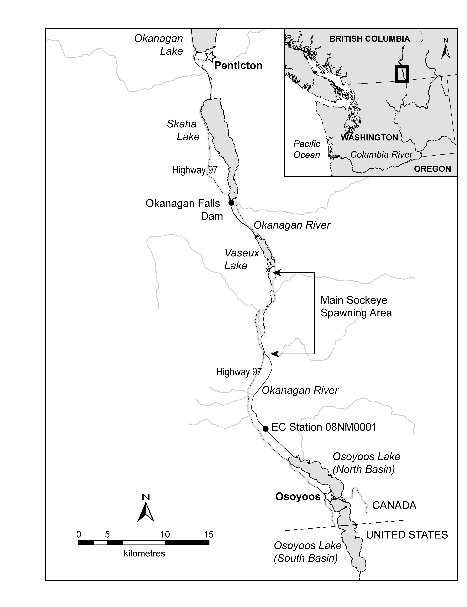

\newpage
# Abstract
Spawner abundance is a fundamental variable for salmon management models, but conventional methods (trapezoidal area under the curve) do not estimate the precision of abundance, and risk being biased by an assumed residence time. Here we present a hierarchical model that predicts visual counts of spawners by modelling the process and timing of spawner arrivals and exits. Our model provides annual estimates of spawner abundance, arrival timing, arrival spread, exit timing, and exit spread. By directly estimating these parameters and integrating uncertainty into abundance estimates, our approach improves the accuracy and reliability of spawner abundance estimates. We first demonstrate how the model accurately recovers parameters from simulated data, and then demonstrate its application by estimating 25 years of spawner abundance of wild sockeye salmon in the Okanagan River (BC, Canada). Our median estimated residence time of 9.1 days is shorter than the constant 11 days previously assumed for this population, and has considerable interannual variation (6.2–16.5 days). Thus, our estimated abundances are 15.7% higher, on average, but deviations can be much larger in individual years.

\noindent\textbf{Keywords:} salmon; Oncorhynchus; spawner; spawner survey; Osoyoos Lake; Okanagan River; Columbia River

\newpage

```{r setup, include = FALSE}
library(knitr)
library(magrittr)
library(tidyverse)
library(tidybayes)
library(rstan)
library(loo)
library(patchwork)
library(ggrepel)
library(janitor)
library(scales)
library(geomtextpath)
library(lubridate)
library(ggallin)
library(kableExtra)
library(ggokabeito)

theme_set(theme_bw())
```

```{r load_data, include=FALSE}
file.exists("../data/spawn_timing.csv")

spawners <- read.csv("../data/spawn_timing.csv") %>% 
  mutate(date = as.Date(date), year = year(date), yday = yday(date))

index_sk <- spawners %>% 
  mutate(duplicate = duplicated(.)) %>% 
  filter(duplicate==FALSE) %>% 
  group_by(location, year, yday, date) %>% 
  filter(location == "Index") %>% 
  filter(species == "sk") %>% 
  summarise(
    live = if (all(is.na(live))) NA_real_ else sum(live, na.rm = TRUE),
    dead = if (all(is.na(dead))) NA_real_ else sum(dead, na.rm = TRUE)) %>% 
  arrange(date) %>% 
  ungroup() %>% 
  mutate(day_ind = as.numeric(factor(yday)), 
         year_ind = as.numeric(factor(year))) %>% 
  filter(!is.na(live)) 

index_sk %>% 
  ggplot(aes(x = yday, y = 1e-3*live, color = location))+
  geom_point(size=0.5, color='black')+
  facet_wrap(~year,scales="free_y") + 
  theme(strip.background = element_rect(color="NA", fill="NA"))+
  theme(panel.grid.minor = element_blank(), legend.position = "none")+
  labs(y="Live Spawners Present ('000)", x="Day of the Year")+
  scale_y_log10()+
  geom_vline(xintercept = 266, lty = 2)

index_excluded <- index_sk |> filter(yday <= 266 & live<500)
index_sk <- index_sk |> filter(!(yday <= 266 & live<500))
```

```{r trad_AUC, include = FALSE}
trad_AUC <- index_sk %>%            
  group_by(year) %>%   
  mutate(tdiff = date - lag(date),                      
         tdiff = replace(tdiff, which(tdiff < 0), NA),
         xbar = (live + lag(live))/2, 
         fishdays = case_when(                          
           is.na(xbar) ~ live * 11/2,         
           !is.na(xbar) ~ as.numeric(tdiff) * xbar
         ),
         cumulative = cumsum(fishdays)) %>%  
  group_by(year) %>%     
  summarise(total_auc = max(cumulative, na.rm = TRUE) +
              (live[which.max(date)]*(11/2)), #this adds in the right tail.
            nerkids = round(total_auc/11,0))
```

```{r stan, include = FALSE}
day_stand <- min(index_sk$yday)

priors <- data.frame(prior = c("log_runs_mu", "arrival_mu", "arrival_sigma", "spread","spread_sigma","residence", "count_dispersion"),
                     v1 = c(10,280-day_stand, 2, 2, 2, log(11-1), log(20)), 
                     v2 = c(1,2,0.2,0.2, 0.3, 0.2, 0.5))


sp_dat = list(n_priors = nrow(priors), 
              priors = data.matrix(priors[,-1]),
              n_years = max(index_sk$year_ind),
              year = as.numeric(factor(index_sk$year)),
              day = index_sk$yday-day_stand,
              n_obs = nrow(index_sk),
              live_counts = index_sk$live)

init_fun <- function() list(
  log_run = rnorm(sp_dat$n_years, 10, 0.5),
  arrival = rnorm(1, 40, 2),
  arrival_mu = rnorm(1, 40, 2),
  arrival_sigma = rlnorm(1, log(1), 0.2), 
  arrival_spread = exp(rnorm(1, 2, 0.2)),
  arrival_spread_mu = rnorm(1, 2, 0.2),
  exit_spread = exp(rnorm(1, 2.5, 0.2)),
  exit_spread_mu = rnorm(1, 2.5, 0.2),
  exit_lag = exp(rnorm(1, 2.5, 0.2)),
  exit_lag_mu = rnorm(1, 2.5, 0.2),
  timing_sigma = rlnorm(4, log(1), 0.2),
  timing_mu = c(rnorm(1, 40, 2), rnorm(1, 2, 0.2), rnorm(2, 2.5, 0.2)),
  live_phi = rlnorm(1, log(50), 0.1)
)


run_or_load_stan <- function(model_name, stan_path, data_list, chains = 4, cores = 4, max_treedepth = 11, adapt_delta = 0.95, iter = 2000) {
  fit_file <- paste0("../model_fits/", model_name, ".RData")
  hash_file <- paste0("../model_fits/", model_name, ".md5")
  current_hash <- unname(tools::md5sum(stan_path))
  
  if (!file.exists(fit_file) || !file.exists(hash_file) || readLines(hash_file) != current_hash) {
    message("Fitting ", model_name, "...")
    m <- stan_model(file = stan_path)
    fit <- sampling(m, data = data_list, iter = iter, chains = chains, cores = cores, control = list(adapt_delta = adapt_delta, max_treedepth = max_treedepth), init = replicate(4, init_fun(), simplify = FALSE))
    save(fit, m, file = fit_file)
    writeLines(current_hash, hash_file)
  } else {
    message("Loading saved fit for ", model_name, "...")
    load(fit_file)
  }
  return(fit)
}

if(!file.exists("../stan/spawners_m1.stan")) stop('STOP no file ../stan/spawners_m1.stan')
if(!dir.exists("../model_fits")) stop('STOP no folder ../model_fits')

fit_m1 <- run_or_load_stan("spawner_m1", "../stan/spawners_m1.stan", sp_dat, max_treedepth = 12)
fit_m2 <- run_or_load_stan("spawner_m2", "../stan/spawners_m2.stan", sp_dat, max_treedepth = 12)
fit_m3 <- run_or_load_stan("spawner_m3", "../stan/spawners_m3.stan", sp_dat, max_treedepth = 12)
fit_m6 <- run_or_load_stan("spawner_m6", "../stan/spawners_m6.stan", sp_dat, max_treedepth = 12)
fit_m4 <- run_or_load_stan("spawner_m4", "../stan/spawners_m4.stan", sp_dat, max_treedepth = 12)
fit_m5 <- run_or_load_stan("spawner_m5", "../stan/spawners_m5.stan", sp_dat, max_treedepth = 12)
fit_m7 <- run_or_load_stan("spawner_m7", "../stan/spawners_m7.stan", sp_dat, max_treedepth = 12)
fit_m8 <- run_or_load_stan("spawner_m8", "../stan/spawners_m8.stan", sp_dat, max_treedepth = 12)
fit_m8_MVN <- run_or_load_stan("spawner_m8_MVN", "../stan/spawners_m8_MVN.stan", sp_dat, max_treedepth = 12)

# model checks
worst_Rhat <- summary(fit_m8_MVN)$summary %>% 
  as.data.frame() %>% 
  mutate(Rhat = round(Rhat, 3)) %>% 
  arrange(desc(Rhat))

worst_Rhat %>% 
  #filter(n_eff>3) %>% 
  ggplot(aes(x = n_eff, y = Rhat))+
  geom_point()+
  geom_hline(yintercept = 1.01, lty = 2)+
  geom_vline(xintercept = 400, lty = 2)

traceplot(fit_m8_MVN, pars = rownames(worst_Rhat)[1:9])

loo_m1 <- loo(fit_m1)
loo_m2 <- loo(fit_m2)
loo_m3 <- loo(fit_m3)
loo_m4 <- loo(fit_m4)
loo_m5 <- loo(fit_m5)
loo_m6 <- loo(fit_m6)
loo_m7 <- loo(fit_m7)
loo_m8 <- loo(fit_m8)
loo_m8_MVN <- loo(fit_m8_MVN)

loos <- list(
  m1 = loo_m1,
  m2 = loo_m2,
  m3 = loo_m3,
  m4 = loo_m4,
  m5 = loo_m5,
  m6 = loo_m6,
  m7 = loo_m7,
  m8 = loo_m8,
  m9 = loo_m8_MVN)

cmp <- loo_compare(loos)

loo_df <- as.data.frame(cmp) %>%
  tibble::rownames_to_column("model") %>%
  rename(
    dloo = elpd_diff,
    se = se_diff
  ) |> 
  arrange(model) |> 
  mutate(model = as.numeric(stringr::str_extract(model, "\\d+")))


fit <- fit_m8_MVN
post <- rstan::extract(fit)
```

# Introduction

## Spawner survey analyses

Functions relating the abundance of spawners to the subsequent
abundance of their offspring returning as adults ("recruits" to
fisheries) are fundamental to the management of salmon fisheries and
salmon habitats [@ricker1975; @hilborn1992]. For salmon, spawner
abundance in a river, stream, or lake beach is typically estimated
through repeated visual surveys – from a boat, a helicopter, a drone,
while snorkeling or walking – that count the number of spawners present
across multiple days during the spawning period. As part of the survey
process, counts are adjusted for observer efficiency (estimated percent observed
of salmon present, @hilborn1999) and extrapolated to survey areas not
observed. Those adjustments are not considered in what follows.
Converting repeated daily estimates of spawners *present* into a yearly
estimate of spawner *abundance* requires accounting for two factors: (1)
surveys typically do not cover every day of the spawning period, and (2)
spawning fish generally remain on the spawning grounds for multiple
days: 8.8-18.7 days for sockeye salmon; @perrin1990. Conventional
methods adjust for these factors but rely on assumptions that can
introduce bias and fail to account for uncertainty.

The classic and still widely used method is based on *trapezoidal area
under the curve* [TAUC\; @ames1977; @perrin1990]. This is a
non-parametric approach, where "curve" means linear interpolations of
counts between survey dates ([a Reimann
sum](https://en.wikipedia.org/wiki/Riemann_sum "wikipedia")) to fill in
missing survey days [@english1992; @irvine1992]. Prior knowledge about
first and last dates for presence of spawners is required and often
assumed. The resulting integral has units of $fish \times days$. To
account for repeat observations of individual fish, total spawner
abundance is calculated by dividing $fish \times days$ by the average
**residence time** (survey life, $days$) of a spawner on the surveyed
spawning ground. Residence time has been found to vary across years and
across spawning grounds, so it is recommended that annual,
spawning-ground-specific estimates should be used [@bocking1988;
@perrin1990; @irvine1992]. There are a range of methods for estimating
residence time [reviewed in @perrin1990]. Estimating residence time is
difficult and requires additional surveying, so residence time is often
assumed, sometimes based on similarity between populations [e.g.,
@hyatt2010]. Residence time acts as a scalar on the survey counts and
can introduce substantial bias to spawner abundance estimates if the
assumed value is incorrect.

To account for observation error, a continuous curve (normal, i.e., Gaussian, if symmetric; otherwise beta [@hilborn1999] or Weibull [@labelle2021], as
examples) can be fit to the time series of survey estimates in a year
using linear regression [@millar2012]. This produces a *Gaussian area
under curve* (GAUC), where total spawning abundance is the integral of
the curve, corrected for residence time as for TAUC. This parametric
approach has been extended by applying hierarchical regression to
analyze multiple years or spawning grounds simultaneously, enabling more
reliable estimates of spawner abundance when data are sparse by
leveraging information shared across years or locations [@adkison2001;
@su2001]. GAUC improves upon TAUC by estimating precision for spawner
abundance, but still relies on an assumed (independently estimated)
residence time. Additionally, it assumes that the arrival and exit
processes -- due to death for semelparous salmon -- combine to produce
the assumed temporal distribution of spawners present on the spawning
grounds.

## Arrival-exit models

Mechanistic models of the arrival and exit processes [@szerlong2008]
address some of the limitations of the TAUC and GAUC approaches. As
initially developed for salmon by @quinn1997, the number of spawners
present during a survey is the number of arrivals cumulative to a survey date, minus
exits cumulative to that date (Figure \ref{fig:fig-enterexit}). Residence time, as the
lag between mean arrival date and mean exit date (we later refer to this
as *exit lag*), was then an estimated parameter rather than an
assumption. In the subsequent model by @hilborn1999, arrivals and exits
were assumed to follow the same cumulative distribution. @su2001 and
@adkison2001 extended this framework to make residence time a declining
function of arrival date. They also allowed for interannual variation
in the timing parameters, estimated for all years simultaneously in
hierarchical regression to improve estimates in years with sparse data.
Further variations were explored by @labelle2021, including multiple
modes of spawner arrivals. Despite its practical utility [@holt2008],
the hierarchical arrival-exit process model has not been widely adopted
to estimate spawner abundance.

This paper introduces further evolution of the arrival-exit approach
[e.g., @hilborn1999; @su2001]. Our model differs from previous approaches by
estimating four timing parameters: (1) **arrival timing**, the average
day of spawner arrivals; (2) **arrival spread**, the variation (as
standard deviation, assuming normal distribution) in spawner arrival dates; (3)
**exit lag**, the difference between mean arrival date and mean exit
date; and (4) **exit spread**: the variation in exit timing
(Figure \ref{fig:fig-enterexit}). This avoids imposing a specific function relating
arrival date and residence time, as in @su2001. As a further
improvement, we model the timing parameters as a multivariate normal
distribution (MVN) with an estimated covariance structure. This
recognizes the likelihood of correlations among timing parameters, by
quantifying and applying these. We use a hierarchical Bayesian
framework, enabling estimation of interannual variation in both spawner
timing and abundance. This hierarchical structure shares information
across years, improving estimates when data are sparse while reducing
the risk of over-fitting.

We first demonstrate the performance of the model by showing how it can
accurately recover spawner timing and abundance parameters from
simulated data. Then we apply it to 25 years of visual spawner
enumeration surveys in the Okanagan River, to demonstrate its utility
for ecological inference and for management-relevant estimation of
spawner abundance.

```{r fig-enterexit, echo=FALSE, warning=FALSE, message=FALSE, fig.height = 4, fig.width = 6, fig.align= 'center', fig.cap = "Example of how the model estimates total spawner abundance, arrival timing, arrival spread, exit lag, and exit spread based on the observed counts (points) of spawners on multiple days. The number of spawners present on a given day is the difference between accumulated arrivals and accumulated exits. We assumed spawner counts are imperfect observations of the true number (sampling error), so individual points differ from the estimated presence. The total abundance of spawners is estimated as the total number that arrived across all dates. All model parameters are estimated with uncertainty – lines show the posterior median, bands show the 95% credible intervals. For the arrival and exit curves, uncertainty grows as abundance increases. This is because uncertainty in the timing of arrivals and exits combines with the uncertainty in the overall abundance estimates."}
j <- 24 # used 2024 as example

example_year <- index_sk %>% filter(year_ind == j)

start_day <- 10
day_seq <- start_day:(max(example_year$day_ind)+10)
arrived <- sapply(day_seq, FUN = function(x) {
  pnorm(x, post$arrival[,j], post$arrival_spread[,j]) * exp(post$log_run[,j])
}) %>% 
  as_tibble() %>%
  mutate(draw = row_number()) %>%
  pivot_longer(-draw, names_to = "day", values_to = "spawners") %>%
  mutate(day = as.integer(gsub("V", "", day)) + (start_day) - 1) %>% 
  mutate(type = "arrived")

exited <- sapply(day_seq, FUN = function(x) {
  pnorm(x, post$arrival[,j] + post$exit_lag[,j], post$exit_spread[,j]) * exp(post$log_run[,j])
}) %>% 
  as_tibble() %>%
  mutate(draw = row_number()) %>%
  pivot_longer(-draw, names_to = "day", values_to = "spawners") %>%
  mutate(day = as.integer(gsub("V", "", day)) + (start_day) - 1) %>% 
  mutate(type = "exited")

counts <- sapply(day_seq, FUN = function(x) {
  entered <- pnorm(x, post$arrival[,j], post$arrival_spread[,j])
  exited <- pnorm(x, post$arrival[,j] + post$exit_lag[,j], post$exit_spread[,j])
  
  exp(post$log_run[,j] + log(entered - (entered * exited)))
}) %>% 
  as_tibble() %>%
  mutate(draw = row_number()) %>%
  pivot_longer(-draw, names_to = "day", values_to = "spawners") %>%
  mutate(day = as.integer(gsub("V", "", day)) + (start_day) - 1) %>% 
  mutate(type = "present")

example_data <- bind_rows(arrived, exited, counts) %>% 
  group_by(type, day) %>% 
  summarise(l89 = quantile(spawners, probs = 0.065), 
            u89 = quantile(spawners, probs = 0.945),
            spawners = median(spawners))

mean_arrival_day <- median(post$arrival[,j])
median_residence <- median(post$exit_lag[,j])
y_value <- median(pnorm(mean_arrival_day, post$arrival[,j], post$arrival_spread[,j]) * exp(post$log_run[,j]))
x_start <- mean_arrival_day + day_stand
x_end <- mean_arrival_day + median_residence + day_stand

residence_df <- data.frame(
  x = x_start,
  xend = x_end,
  y = y_value,
  yend = y_value,
  label = "residence"
)

ggplot(example_data, aes(x = day + day_stand, y = spawners, group = type))+
  geom_ribbon(aes(ymin = l89, ymax = u89), color = NA, alpha = 0.2)+
  geom_textline(size = 4, linewidth = 1, aes(label = type), hjust = 0.65, family = "sans") +
  scale_x_continuous(labels = ~ format(as.Date(.x, origin = "2023-12-31"), "%b ") %>% 
                       paste0(as.integer(format(as.Date(.x, origin = "2023-12-31"), "%d"))),
                     breaks = as.numeric(as.Date(c("2024-09-15", "2024-10-01", "2024-10-15", "2024-11-01", "2024-11-15")) - as.Date("2023-12-31")), 
                     name = "", expand = c(0, 0))+
  scale_y_continuous(labels = label_number(scale = 1e-3, suffix = "k"), name = "Spawners", expand = expansion(mult = c(0, 0)), limits = c(0, 0.3e5), breaks = seq(0, 0.3e5, by = 0.05e5))+
  geom_point(data = example_year, aes(x = yday, y = live, group = NA), color = "red", size = 2)+
  #geom_textsegment(data = residence_df, aes(x = x_start, xend = x_end, y = y_value, yend = y_value, label = "residence"), linewidth = 0.5, inherit.aes = FALSE, size = 2.8, family = "sans")+
  annotate("text",
           x = Inf,
           y = max(example_data$spawners),  
           label = "total abundance",
           hjust = 1.03,
           vjust = -0.3,
           size = 4,
           family = "sans")+
  theme_bw()+
  theme(panel.grid = element_blank())

```

# Methods

## Model

We modelled spawner abundance based on observed spawner counts using a
series of hierarchical Bayesian models, fitted in the Stan programming
language [@standevelopmentteam2020] by using the rStan package
[@standevelopmentteam2020] in R v4.4.0 [@rcoreteam2025]. These models
varied in the degree to which they allowed for interannual variation in
the four timing parameters (arrival timing and spread, exit lag and
spread) and whether those parameters were jointly estimated using a
multivariate normal distribution (MVN) to account for correlations. All
models follow the processes shown in Figure \ref{fig:fig-enterexit}. These models
deal only with live spawners. Spawner counts are integers and can include
zero, therefore we used a negative binomial distribution for the
observation model:

\begin{equation}
N_{y,d} \sim \text{NegBinomial}(\mu_{y,d}, \phi)
\end{equation}

where
$N_{y,d}$ is the probability density distribution (PDD) for predicted
counts, $\mu_{y,d}$ is the expected number of live spawners present in
year $y$ on day $d$, and $\phi$ captures variability around $\mu_{y,d}$,
including both observation error and natural variation that is not
explicitly modelled. We assume that this expected number of spawners
present, $\mu_{y,d}$, is a function of three unobserved (*i.e.*, latent)
quantities that are estimated in our model: (1) $p^\text{arrived}_{y,d}$, the proportion of spawners that have arrived
by day $d$; (2) $p^\text{exited}_{y,d}$, the proportion of spawners that
have exited by day $d$, (*i.e.*, died or left the spawning grounds), and
(3) $N_y$, the total spawner abundance in that year:

\begin{equation}
\mu_{y,d} \approx p^\text{arrived}_{y,d} \times (1 - p^\text{exited}_{y,d}) \times N_y.
\label{eq:eq-live}
\end{equation}

We assume that the spawners arrive over a range of days that follows a
normal distribution, reside there for some days of spawning activity,
and then die or leave the spawning grounds (other distributions for
skewed or multimodal arrivals may be applicable). Thus, the proportion of
spawners that have arrived by a given date $d$ in year $y$ follows a
cumulative normal distribution:

\begin{equation}
p^\text{arrived}_{y,d} = \Phi\left( \frac{ d - \mu^\text{arrival}_y }{ \sigma^\text{arrival}_y } \right).
\end{equation}

Likewise, the proportion of arrived spawners that have exited the live
count by a given date $d$ in year $y$ follows a second cumulative normal
distribution:
\begin{equation}
p^\text{exited}_{y,d} = \Phi\left( \frac{ d - (\mu^\text{arrival}_y + \mu^\text{exit lag}_y)}{\sigma^\text{exit}_y} \right),
\label{eq:eq-exited}
\end{equation}

where $\mu^\text{exit lag}_y$ defines the number of days by which the
mean exit date lags behind the mean arrival date $\mu^\text{arrival}_y$.

Total spawner abundance, $N_y$, in each year is a primary variable of
interest and is estimated by the model as the scaling factor that links
the estimated arrival and exit processes to the expected live spawners,
$\mu_{y,d}$. We set a prior on spawner abundance as
$log(N_y) \sim \text{Normal}$(`r priors[1,2]`, `r priors[1,3]`). This
weakly informative prior is consistent with the range of log-transformed
spawner abundances previously estimated for this population using
trapezoidal AUC, but does not constrain estimates to match those values.

To prevent numerical instability when Equation \ref{eq:eq-live} approaches zero,
we use a log-transformed approximation of the same form:

\begin{equation}
\mu_{y,d} =  \exp\left( \log\left(1 + 10^4 \times p^\text{arrived}_{y,d} \times (1 - p^\text{exited}_{y,d})\right) - \log(10^4) \right) \times N_y 
\end{equation}

where the factor $10^4$ serves as a scaling factor that prevents changes
in near-zero values from having an abrupt influence on $\mu_{y,d}$.

In the equations above, we specified $\mu^\text{arrival}_y$,
$\sigma^\text{arrival}_y$, $\mu_y^\text{exit lag}$, and
$\sigma^\text{exit}_y$ using subscript $y$ to indicate that they vary
from year to year. Some of these timing parameters may not need to vary
annually in a model applied to a specific situation, so we compared a
series of models with different combinations of varying and constant
versions of these parameters (summarized in Figure \ref{fig:fig-modcompare}A) and
evaluated their fit to withheld data [Leave One Out, @vehtari2017], as
described in section 2.1.1.

The time-varying versions of these parameters were estimated using a
hierarchical structure, where yearly values were drawn from a
hyperdistribution (e.g.,
$\mu^\text{arrival}_y \sim \text{Normal}(\mu^\text{arrival}_\mu, \mu^\text{arrival}_\sigma)$)
defined by the multiyear mean and interannual standard deviation. We
set a prior for the arrival day group mean as
$\mu^\text{arrival}_\mu \sim \text{Normal}$(`r priors[2,2]`,
`r priors[2,3]`), corresponding to
`r format(as.Date(priors[2,2] + day_stand, origin = "2024-01-01"), "%B%e")`
($\pm$ `r round(1.96*priors[2,3])` days), which is approximately
`r round(priors[2,2]/max(sp_dat$day)*100)`% of the way through the
typical spawning survey period. This reflects our expectation that peak
arrivals occur during the early to mid portion of the survey window. We
used the prior
$\mu_\sigma^{\text{arrival}} \sim \text{Lognormal}$(log(`r priors[3,2]`), `r priors[3,3]`)
to represent a moderate level of expected interannual variation in
$\mu_y^{\text{arrival}}$. We modelled $\sigma^\text{arrival}_y$,
$\mu_y^\text{exit lag}$ and $\sigma^\text{exit}_y$ using priors of the
form $\text{Exponential}(\lambda)+1$ to ensure that parameters were
strictly positive and bounded away from zero following the biological
constraint that spawners vary in their arrival and exit timing, and that
they remain on the spawning grounds for at least one day. For these
spread and lag parameters, the hierarchical structure is applied on the
log-transformed scale to improve sampling and ensure positivity. We set
priors for $\sigma_\mu^\text{arrival}$ and $\sigma_\mu^\text{exit}$ as
$\sim \text{Normal}$(`r priors[4,2]`, `r priors[4,3]`),
corresponding to an expectation that arrival and exit timing should have
similar spread. We set the prior for $\mu_\mu^\text{exit lag}$ as
$\sim \text{Normal}(\log$(`r exp(priors[6,2])`), `r priors[6,3]`),
aligning with the previously assumed residence time of approximately 11
days, and with likely values ranging from
`r round(exp(priors[6,2] - 1.96* priors[6,3])+1)` to
`r round(exp(priors[6,2] + 1.96* priors[6,3])+1)` days. We used the same
$\sim \text{Lognormal}$(log(`r priors[5,2]`), `r priors[5,3]`) prior for
$\mu_\sigma^{\text{spread}}, \mu_\sigma^{\text{exit}}$, and
$\mu_\sigma^{\text{exit lag}}$ to represent a moderate level of expected
interannual variation in these parameters on the log-transformed scale.

In the models where we use constant (not varying by year) versions of
the timing parameters, we drop the subscript $y$ and denote them as:
$\mu^\text{arrival}$, $\sigma^\text{arrival}$, $\mu^\text{exit lag}$,
and $\sigma^\text{exit}$. In these cases, we use the prior for the group
level $\mu$ and omit the group-level variance parameter, thus removing
the hierarchical structure.

In the model where all timing parameters have interannual variation, we
compare a version where they are estimated independently to a model
where they are jointly estimated using a multivariate normal
distribution (MVN). We specify this joint estimation as:
\begin{equation}
\boldsymbol{\theta_y} \sim \text{MVN}(\boldsymbol{\mu}, \boldsymbol{\Sigma}),
\end{equation}

where $\boldsymbol{\theta_y}$ is a vector of the four timing parameters
in each year,

\begin{equation}
\boldsymbol{\theta_y} = [\mu^\text{arrival}_y, \log(\sigma^\text{arrival}_y - 1), \log(\sigma^\text{exit}_y - 1), \log(\mu^\text{exit lag}_y - 1)],
\end{equation}

and $\boldsymbol{\mu}$ is a vector of the timing parameter group level
means,
\begin{equation}
\boldsymbol{\mu} = [\mu^\text{arrival}_\mu, \log(\sigma^\text{arrival}_\mu - 1), \log(\sigma^\text{exit}_\mu - 1), \log(\mu^\text{exit lag}_\mu - 1)].
\end{equation}

The $\log(x - 1)$ transformation for the spread and lag parameters
ensures that they remain positive and bounded away from zero, while also
improving sampling stability, as described above. The parameter
$\boldsymbol{\Sigma}$ is the residual covariance matrix, which describes
both the amount of interannual variation in each timing parameter and the
correlation among them. This structure jointly estimates the timing
processes, allowing the model to capture interdependence between them, for example, if the exit lag is longer in years when arrival timing is earlier.

Chains were initialized with random draws from biologically plausible ranges for timing, abundance, and overdispersion parameters (Table \ref{tab:tbl-init}). This was necessary because Stan's default initialization often led to poor convergence, with chains exploring different regions of the parameter space. Using biologically plausible initialization improved adaptation and ensured all chains converged to the same posterior distribution.

We used ChatGPT (model 4o) as a tool to support Stan model development,
including brainstorming model structure and identifying causes of
convergence issues. ChatGPT was not used to generate Stan code directly,
and all suggestions were reviewed and verified by the authors for logic
and accuracy.

### Diagnostics

An essential concept in Bayesian statistics is that the data are known
but the best model for those data is unknown [@mcelreath2020] and are always
a vast simplification of reality [@jaynes2003]. Metrics to compare and
rank competing models are required. In ecological systems, a
superabundance of habitat indicators as covariates means over-fitting is
a problem. Leave-one-out (LOO) statistics, where each point is predicted
while omitted from fitting (cross-validation), provide diagnostics to evaluate predictive power and
over-fitting. We used the sum of *expected log predictive probability
density* (ELPD) for each of $n$ omitted observations' predictions, and
$\mathrm{ELPD}_{SE}=\text{sd}(\mathrm{ELPD})/\sqrt{n}$, the standard
error of those probabilities [@vehtari2017].

### Effective residence time

Although $\mu^\text{exit lag}_y$ defines the average delay between
arrival and exit distributions, it does not equal the residence time
used by TAUC. This is because the residence time of individual spawners
depends on the interactions of arrival and exit processes; it is not
directly estimated by a single parameter of the model. Importantly,
whenever $\sigma^\text{arrival}_y \neq \sigma^\text{exit}_y$, individual
residence time cannot be the same for all spawners, and instead varies
depending on when each spawner arrives. We can, however, calculate an
*effective residence time* in each year based on the sum of the estimated
number of live spawners across all days in the spawning period, $D$,
divided by the estimated total spawner abundance:

\begin{equation}
\mu^{\text{residence}}_y = \frac{\sum_{d = 1}^D \left(p^\text{arrived}_{y,d} \times (1 - p^\text{exited}_{y,d}) \times N_y^{\text{spawners}}\right)}{N_y^{\text{spawners}}}.
\label{eq:eq-residence}
\end{equation}

This is the equivalent of back-calculating residence time from the area
under the curve, which is possible because we have directly estimated
$N_y^{\text{spawners}}$. However, because $N_y^{\text{spawners}}$
appears in both the numerator and the denominator of Equation \ref{eq:eq-residence}, we
can simplify this equation as:
\begin{equation}
\mu^{\text{residence}}_y = \sum_{d = 1}^D \left(p^\text{arrived}_{y,d} \times (1 - p^\text{exited}_{y,d})\right).
\end{equation}


## Simulations

```{r simulations, include = FALSE}
#values that define simulations
log_run_mu               <-  10    # log value for lognormal PDD, 
log_run_sigma            <-   1    # log value for lognormal PDD, 
arrival_timing_mu        <-  35    # normal  
arrival_timing_sigma     <-   1    # 95% days 33 to 37 
arrival_spread_mu        <-   4    # normal
arrival_spread_sigma     <-   0.2  # 95% 3.6 to 4.4
exit_lag_mu              <-  10    # normal 
exit_lag_sigma           <-   0.5  # 95% 9 to 11
exit_spread_mu           <-   3    # normal. should be < arrival_spread_mu
exit_spread_sigma        <-   0.2  # 95%  2.6 to 3.4
years_n                  <-  20    # number of years, 4x3 plot
days_n                   <- 100    # initial number of days, checked below.
samp_accuracy            <-   0.15 # rnorm(n, 1, 0.15) 
# 15% sampling error, +/- 95% = 0.3 is a lot. Likely under not over. 
gaps                     <- c(1,3,5,7) # days between surveys. survey_gaps identifies scenarios.

sim_params <- data.frame(parameter = c("log run", "arrival", "arrival spread", "exit lag", "exit spread"),
                         mu = c(log_run_mu, arrival_timing_mu, arrival_spread_mu, exit_lag_mu, exit_spread_mu),
                         sigma = c(log_run_sigma, arrival_timing_sigma, arrival_spread_sigma, exit_lag_sigma, exit_spread_sigma),
                         distribution = c("Normal"))

if(!file.exists("../data/simulations.RData")){
  m <- stan_model("../stan/spawners_m8.stan")
  
  
  # derived
  days  = 1:days_n                   # overrides lubridate::days()
  years = 1:years_n                  # overrides lubridate::years()
  sim = c(arrival_timing_mu, arrival_timing_sigma,
          arrival_spread_mu, arrival_spread_sigma,
          exit_spread_mu, exit_spread_sigma, 
          exit_lag_mu, exit_lag_sigma)
  
  
  
  n_sim <- 20
  n_success <- 0
  attempt <- 1
  sim_summary <- data.frame()
  
  while (n_success < n_sim) {
    message(sprintf("attempt %d (successes so far: %d)", attempt, n_success))
    #single simulation
    draws = data.frame(  year = years,
                         run             = rlnorm(years_n,  log_run_mu, 
                                                  log_run_sigma) %>% round,
                         arrival_timing  = rnorm(years_n, arrival_timing_mu,
                                                 arrival_timing_sigma) %>% round(2),
                         arrival_spread  = rnorm(years_n,arrival_spread_mu,
                                                 arrival_spread_sigma)  %>% round(2),
                         exit_lag        = rnorm(years_n, exit_lag_mu, 
                                                 exit_lag_sigma) %>% round(2),
                         exit_spread     = rnorm(years_n,exit_spread_mu, 
                                                 exit_spread_sigma) %>% round(2) )
    
    sim_values.df <- draws |> 
      rename(arrival = arrival_timing) |> 
      mutate(log_run = log(run)) |> 
      gather(key = .variable, value = true_value, -year)
    
    present <- sapply(1:years_n, function(i){
      entered <- pnorm(days, draws$arrival_timing[i],  draws$arrival_spread[i])
      exited  <- pnorm(days, draws$arrival_timing[i] + draws$exit_lag[i], draws$exit_spread[i])
      present <- (entered * (1-exited) * draws$run[i]) # zero if out before in
    }) 
    
    dat_sim = data.frame(
      year    = rep(years,each=days_n),
      day     = rep(days,years_n),
      present = present%>% as.vector %>% round)
    # first and last days of presence over all year.
    a= dat_sim$day[dat_sim$present > 0]
    day_first = min(a)
    day_last  = max(a) 
    
    dat_sim %<>% mutate(sampled = present*rnorm(nrow(dat_sim),1, samp_accuracy))
    dat_sim %<>% mutate(sampled = floor(sampled)) # truncate: 0.9 fish -> 0 fish.
    # determine survey dates with 1, 3, 5, 7 day gaps. 
    # save four survey scenarios. Same dates all years
    days_surveyed <- sapply(gaps, function(j) seq(day_first,day_last, by=j))
      
    # create long form data frame for scenarios
    sampled.df <- data.frame()
    for(i in 1:length(days_surveyed)){
      sampled.df <- bind_rows(sampled.df, 
                              dat_sim %>% filter(day %in% days_surveyed[[i]]) %>%
                                mutate(survey_gaps=gaps[i] ))
    }
    # delete if present =< 0 or sampled =< 0 
    sampled.df %<>% filter((sampled > 0) & (present > 0))
    
    sp_dat_0 = list(
      n_priors     = nrow(priors),
      priors      = data.matrix(priors[,-1]),
      n_years     = years_n, 
      arrival_mu  = arrival_timing_mu )
    
    annual_medians= data.frame() # fitted medians annual parameters
    # loop through the four scenarios of survey gaps
    sim_fail <- FALSE         
    for (j in gaps){   # 1,3,5,7 
      # insert scenario data into stan data  
      k = sampled.df$survey_gaps == j  # which rows
      sp_dat = list_modify(sp_dat_0,
                           n_obs = sum(k),
                           year  = sampled.df$year[k],
                           day   = sampled.df$day[k],
                           live_counts= sampled.df$sampled[k] %>% as.integer )
      
      fit_sim <- sampling(m, data = sp_dat, iter = 2000,
                          chains = 4, cores = 4,control = list(adapt_delta = 0.95, max_treedepth = 12), init = replicate(4, init_fun(), simplify = FALSE))
      Rhat_max <- max(summary(fit_sim)$summary[,"Rhat"], na.rm = TRUE)
      n_eff_min <- min(summary(fit_sim)$summary[,"n_eff"], na.rm = TRUE)
      div_trans <- sum(sapply(get_sampler_params(fit_sim, inc_warmup = FALSE), function(x) sum(x[, "divergent__"])))
      
      if (Rhat_max > 1.02 | div_trans > 1) {
        sim_fail <- TRUE
        break     # stop checking other gaps for this sim
      }  
      annual_medians <- bind_rows(annual_medians, 
                                  spread_draws(
                                    fit_sim,
                                    log_run[year],
                                    arrival[year],
                                    arrival_spread[year],
                                    exit_spread[year],
                                    exit_lag[year]
                                  ) %>%
                                    gather(key = .variable, value = .value,
                                           log_run, arrival, arrival_spread, exit_spread, exit_lag) %>%
                                    group_by(year, .variable) %>%
                                    summarise(
                                      est_value = median(.value, na.rm = TRUE),
                                      l95       = quantile(.value, 0.025, na.rm = TRUE),
                                      u95       = quantile(.value, 0.975, na.rm = TRUE),
                                      precision = median(abs(.value - median(.value, na.rm = TRUE)), na.rm = TRUE),
                                      .groups   = "drop"
                                    ) %>%
                                    mutate(
                                      gap       = j,
                                      Rhat_max  = Rhat_max,
                                      n_eff_min = n_eff_min,
                                      div_trans = div_trans
                                    )
      )
    }
    
    
    if (sim_fail) {
      attempt <- attempt + 1
      next  # retry a fresh simulation; do not count this one
    }
    
    # success path
    sim_summary1 <- left_join(annual_medians, sim_values.df) |>
      mutate(
        diff  = true_value - est_value,
        in_95 = (u95 > true_value) & (true_value > l95),
        ratio = est_value / true_value
      ) |>
      arrange(.variable) |>
      mutate(sim = n_success + 1)   # label as 1..n_sim by success order
    
    sim_summary <- bind_rows(sim_summary, sim_summary1)
    
    n_success <- n_success + 1
    message(sprintf("SUCCESS: collected simulation %d of %d", n_success, n_sim))
    
  }
  
  save(sim_summary, file = "../data/simulations.RData")
} else{
  load("../data/simulations.RData")
}
```

To quantify how reliably the statistical model can estimate the annual
values for run size and the four timing parameters, we challenged our
model with simulated data. The simulations were generated using the same
parameters as the statistical model. Each simulation consisted of 20
years of observations, where the annual parameter values governing the
spawning timing and run size were drawn randomly from the distributions
in Table \ref{tab:tbl-sim}. These yearly parameters are considered to be the *true*
values to which we compare the estimated values from the statistical
model. Daily time series for the presence of spawners each day, 
predicted from those *true* values in the model, were modified by
multiplicative normal sampling error (15% precision) to generate
*observed* data. To test the sensitivity of our model to different
sampling frequencies, we contrasted results when we subsampled these
time series with 1, 3, 5 and 7 day gaps. We then ran 20 replicate
simulations to ensure that our results were representative. We fit these
observed data with statistical model 8 (Figure \ref{fig:fig-modcompare}), which is the
same as our selected model 9 but without the multivariate correlation
structure between parameters. Because our goal was to test recovery of
known values rather than parameter correlations, we did not include this
additional complexity in our simulations.

We quantified coverage as the proportion of simulations in which the true value fell within the 95% posterior credible interval. We quantified precision as the median absolute deviation (MAD, a robust version of standard deviation) of the posterior draws around the median, and quantified bias as the median of ratios of fitted over true values. 

## Okanagan sockeye

Our analysis of Okanagan sockeye was confined to the population of wild
Sockeye Salmon that spawn in October and November in the Okanagan River
(Figure \ref{fig:fig-map}) upstream of Osoyoos Lake. After emerging from spawning
gravel, mid-April to mid-May, they spend one or two summers as fry in the North Basin of Osoyoos Lake before migration the
following spring as smolts through the reservoirs, spillways, and smolt passage tunnels of ten hydroelectric
dams to reach the Pacific Ocean via the Columbia River (@hyatt2020).
After one to three years of marine growth, adults return
to the Columbia River in late summer and attempt the transit of ten dams
in a 950 km freshwater migration, before entering Osoyoos Lake and
subsequently spawning yet further upstream. Ascending the Okanagan River
from the Columbia River is increasingly compromised by high river
temperatures [@hyatt2020; @major1967; @quinn1997].

Spawner estimates for Osoyoos sockeye have historically been based on
TAUC, with an assumed residence time of 11 days [@hyatt2010]. This
number was selected based on the estimate for the Early Stuart Sockeye
stock [@perrin1990] because that stock has similar average body size,
migration distance, and migratory timing [@hyatt2010]. Later,
@shardlow2011 used tilt tags on spawning sockeye in the Okanagan River
and estimated the residence time to be 14.1 (females) and 13.7 (males)
days in 2006, and 14.1 (females) and 11.9 (males) days in 2007.
Nevertheless, 11 days has been the consistently assumed value for AUC
estimates in this system [@machin2019].

## Spawner surveys

Spawner enumeration surveys have been conducted by the Okanagan Nation Alliance in the main sockeye
spawning area---also known as the Index Section---of the Okanagan river (Figure \ref{fig:fig-map}) since
`r min(index_sk$year)`. The Index Section consists of the section from
Deer Park to vertical drop structure 12 (VDS12), which is at the Oliver
bridge. Survey methods are described in detail in
@machin2019. No fieldwork permit was required for the surveys as they are visual counts and they fall within the Syilx title and rights regarding Okanagan sockeye. Weekly surveys during the initial migration phase are
increased to three-day intervals during the peak spawning period
(generally October-November). A three or four person crew performs
visual surveys of the Index section from a boat. Two observers focus on
counting live sockeye (holding and spawning), one on each side of the
middle of the boat, while another one or two observers count dead
sockeye and other species (Chinook, Kokanee, and Rainbow Trout) from the
front of the boat. In addition, side channels throughout the Index
section are walked and fish are enumerated [@machin2019]. Since 2012, enumeration of each individual reach within the Index section is available; however, we have used the summed counts across all reaches, because this is the
resolution of data available from 2000--2011. Limited spawning for the
Osoyoos population also occurs in the Okanagan River downstream of the
Index Section, and in the section between Vaseux Lake and the Skaha Lake
Outlet Dam (Okanagan Falls Dam in Figure \ref{fig:fig-map}). We have excluded these
sections from our analysis as including them would require additional
complexity in our model to account for potential variation in timing. It
would also require that we account for the relative abundances across
river sections, which vary through time. This extension is a logical next
step, but is not necessary for demonstrating our method, which is the goal of
this manuscript.


All together, surveys have been conducted on `r nrow(index_sk) +  nrow(index_excluded)`
days, ranging between `r min(table(index_sk$year))` and
`r max(table(index_sk$year))` surveys per year. Early surveys in a year often focus on training new crew members and determining where spawners are on the spawning grounds. Because of this, early surveys with low abundance estimates do not provide a reliable estimate of abundance, and including them in our model increases uncertainty. Therefore, we have excluded any surveys prior to September 23 where fewer than 500 spawners were observed. This excluded `r nrow(index_excluded)` surveys, leaving a total of `r nrow(index_sk)` surveys in our analysis. 

In parts of the Okanagan River, the abundance of co-occurring spawning Kokanee
(an freshwater-resident subspecies of *O. nerka*) have the potential to bias
abundance estimates of Sockeye (diadromous). However, this does not
apply in the Osoyoos Lake spawning grounds, because the size and colour
of these subspecies differ sufficiently for the sampling crew to
distinguish the two subspecies (pers. comm. Karylin Alex, Okanagan
Nation Alliance). Furthermore, our method deals simply with survey
counts, not with observation methods. Complications from co-occurring
Kokanee were addressed using a model similar to ours by @adkison2001.

Although the enumeration survey crews count dead Sockeye, the dead surveys do not
provide a consistent estimate of the accumulation of dead spawners that
could be used in our model. Dead fish are enumerated but not marked or
removed and so can potentially be counted multiple times across survey
dates. However, there is a separate *dead pitch* crew that collects
biosamples multiple times over the course of the spawning period, but at
a lower frequency than the live counts are conducted. When doing so,
this crew removes the sampled fish. Therefore, the counts of dead fish
by the enumeration crew represent accumulated dead spawners, with
infrequent removal, which is not easily accounted for in a model.

# Results

## Model selection and convergence

Based on ELPD statistics (Figure \ref{fig:fig-modcompare}B) we selected model 9 as the
best among those explored. This model was the most complex of those
considered and it included annual variation in spawner abundance,
arrival timing, arrival spread, exit spread, and exit lag with a
multivariate normal (MVN) structure in the annual variation of the four
timing parameters.

The effective number of parameters ($\mathrm{p}_{\mathrm{loo}}$)
increased when arrival timing variation was introduced (model 1 *vs.*
2), and also when any of arrival spread, exit spread, or exit lag were
allowed to vary (models 3 to 9; Figure \ref{fig:fig-modcompare}C). However, all models
with variation in any or all of these parameters (models 3 to 9) had
similar numbers of effective parameters.

Convergence was good for model 9; the highest $\hat{R}$ was
`r round(max(worst_Rhat$Rhat, na.rm = TRUE),3)` and
`r round(mean(worst_Rhat$n_eff>400, na.rm = TRUE)*100, 1)`% of the
parameters had effective sample sizes $>400$ (min =
`r round(min(worst_Rhat$n_eff, na.rm = TRUE))`).

## Model fit to simulated data

We find that the model is able to estimate the parameters used to
generate our simulated data. Regardless of the gap between surveys, the true value of all parameters falls within the 95% credible interval in at least 95% of annual estimates (Figure \ref{fig:fig-sims}A). We find that estimates become less precise as the survey gap increases (Figure \ref{fig:fig-sims}B), particularly for exit lag and arrival timing. The model tends to overestimate exit lag (Figure \ref{fig:fig-sims}B), but this is not consistent across years or simulations. Otherwise, our estimates of bias suggest that there is no tendency for any of the other parameters to be over- or underestimated.

```{r fig-sims, echo=FALSE, , warning=FALSE, message=FALSE, fig.height = 4, fig.width = 9, fig.align= 'center', fig.cap= "Credible interval (95%) coverage (A), median absolute deviation (B), bias (C) for each parameter for simulated data as a function of increasing survey gap (days). All measures compare modelled estimates with true values used to generate the simulations. In panel A, values represent the percent of annual estimates falling within the 95% credible interval, pooled across 20 replicate simulations. In panels B and C, summaries are computed across annual estimates, pooled over 20 replicate simulations, each spanning 20 years. In panels B and C, points show medians and intervals show the 66% and 95% distributions."}

 ggplot(sim_summary |> group_by(gap, .variable) |> summarise(in_95_perc = mean(in_95)*100) , aes(x = gap, y = in_95_perc, color = .variable))+
  geom_hline(yintercept = 100, lty = 2)+
  stat_pointinterval(position = position_dodge(width = 0.7))+
  #scale_color_okabe_ito(name = "")+
  labs(x = "Survey gap (days)",
       y =  "95% CI coverage (%)")+
  scale_x_continuous(breaks = seq(1, 7, by = 2))+
  theme_bw()+

ggplot(sim_summary, aes(x = gap, y = precision * 100, color = .variable))+
  geom_hline(yintercept = 0, lty = 2)+
  stat_pointinterval(position = position_dodge(width = 0.5))+
  #scale_color_okabe_ito()+
  labs(x = "Survey gap (days)",
       y =  "Median absolute deviation (%)")+
  scale_x_continuous(breaks = seq(1, 7, by = 2))+
  theme_bw()+
  theme(legend.position = "bottom")+
  
  ggplot(sim_summary , aes(x = gap, y = (1-ratio)*100, color = .variable))+
  geom_hline(yintercept = 0, lty = 2)+
  stat_pointinterval(position = position_dodge(width = 0.5))+
  #scale_color_okabe_ito()+
  labs(x = "Survey gap (days)",
       y = "Bias (%)")+
  scale_x_continuous(breaks = seq(1, 7, by = 2))+
  theme_bw()+
  
  plot_annotation(tag_levels = "A")+
  plot_layout(guides = "collect") &
  scale_color_okabe_ito(name = "", order = c(1,2,3,5,6)) &
  theme(legend.position = "bottom")

```

## Model fit to Okanagan sockeye counts

Our fitted counts correspond well with the observed Okanagan sockeye
counts (Figures \ref{fig:fig-spawnercurves}, \ref{fig:fig-obsfit}). Variation between the observed
and expected counts is quantified in our estimate of spawner count
overdispersion ($\phi^\mathrm{live}$), which had a posterior median of
`r round(median(post$live_phi), 1)` (95% CI:
`r round(quantile(post$live_phi, 0.025), 1)`--`r round(quantile(post$live_phi, 0.975), 1)`).


```{r effective-residence, include = FALSE}
effective_residence <- matrix(NA, nrow = length(post$log_run[,1]), ncol = ncol(post$log_run))
for(j in 1:ncol(post$log_run)){
  live <- sapply(1:max(sp_dat$day), FUN = function(x) {
    entered <- pnorm(x, post$arrival[,j], post$arrival_spread[,j])
    exited <- pnorm(x, post$arrival[,j] + post$exit_lag[,j], post$exit_spread[,j])
    
    entered * (1 - exited)
  })
  
  effective_residence[,j] <- apply(live, 1, sum)
}

colnames(effective_residence) <- unique(index_sk$year)

```

## Spawning timing

Mean arrival timing ($\mu_y^\text{arrival}$) varied across years
(Figure \ref{fig:fig-timings}A), with posterior medians ranging from `r format(lubridate::ymd("2025-01-01") + round(min(apply(post$arrival, 2, median))+day_stand - 1), "%B %e")` to `r format(lubridate::ymd("2025-01-01") + round(max(apply(post$arrival, 2, median))+day_stand - 1), "%B %e")`. Arrival spread ($\sigma_y^\text{arrival}$) varied across years
(Figure \ref{fig:fig-timings}B), with posterior medians ranging from `r round(min(apply(post$arrival_spread, 2, median)),1)` to
`r round(max(apply(post$arrival_spread, 2, median)),1)` days. Mean exit lag
($\mu_y^\text{exit lag}$) varied across years (Figure \ref{fig:fig-timings}C), with posterior medians ranging from
`r round(min(apply(post$exit_lag, 2, median)),1)` to `r round(max(apply(post$exit_lag, 2, median)),1)` days. Exit spread
($\sigma_y^\text{exit}$) was similar to arrival spread (Figure \ref{fig:fig-timings}D), with posterior medians ranging from
`r round(min(apply(post$exit_spread, 2, median)),1)` to `r round(max(apply(post$exit_spread, 2, median)),1)` days.

Mean arrival timing ($\mu_y^\text{arrival}$) and
arrival spread ($\sigma_y^\text{arrival}$) were positively correlated, with a posterior median correlation of `r round(median(post$Omega[,1,2]),2)` and
`r round(mean(post$Omega[,1,2]>0)*100)`% of samples supporting a
positive relationship (Figure \ref{fig:fig-cor}). Arrival spread and exit lag were positively correlated with a posterior median correlation of `r round(median(post$Omega[,2,4]),2)` and
`r round(mean(post$Omega[,2,4]>0)*100)`% of samples supporting a
positive relationship. Exit spread and exit lag were negatively correlated with a posterior median correlation of `r round(median(post$Omega[,3,4]),2)` and
`r round(mean(post$Omega[,3,4]<0)*100)`% of samples supporting a
negative relationship. Correlations between other combinations of parameter values showed weaker support.

Together, the timing parameters result in interannual variation in the
derived effective residence time (Figure \ref{fig:fig-timings}E). The posterior median
across years is `r round(median(effective_residence), 1)` days, but it
ranges from `r round(min(apply(effective_residence, 2, median)), 1)` to
`r round(max(apply(effective_residence, 2, median)), 1)` days.

```{r fig-timings, echo = FALSE, warning=FALSE, message=FALSE, fig.cap="Posterior distributions of annual mean arrival ($\\mu_y^{\\text{arrival}}$; A), arrival spread ($\\sigma_y^{\\text{arrival}}$; B), exit spread ($\\sigma_y^{\\text{exit}}$; C), and the resulting mean residence time ($\\mu^{\\text{residence}}_y$; D). The dashed line in panel D shows the previously assumed 11 day residence time. Points and error bars show the posterior median and the 66% and 95% credible intervals.", fig.align='center', fig.height=8.5, fig.width=5.5}
spread_draws(fit, arrival[year]) %>% 
  mutate(year = year + min(spawners$year)-1) %>%
  ggplot(aes(x = year, y = arrival + day_stand))+
  stat_pointinterval()+
  xlab("")+
  scale_y_continuous(labels = ~ format(as.Date(.x, origin = "2023-12-31"), "%b %d"), 
                     breaks = seq(275, 300, by = 5), name = bquote("Mean arrival (" * mu[y]^"arrival" * ")"))+
  theme_bw()+
  
  spread_draws(fit, arrival_spread[year]) %>% 
  mutate(year = year + min(spawners$year)-1) %>% 
  ggplot(aes(x = year, y = arrival_spread))+
  stat_pointinterval()+
  scale_y_continuous(breaks = seq(0, 20, by = 3))+
  ylab(bquote("Arrival spread (" * sigma[y]^arrival * ")"))+
  xlab("")+
  theme_bw()+
  
  spread_draws(fit, exit_lag[year]) %>% 
  mutate(year = year + min(spawners$year)-1) %>% 
  ggplot(aes(x = year, y = exit_lag))+
  stat_pointinterval()+
  plot_layout(ncol = 1)+
  ylab(bquote("Exit lag (" * mu[y]^exit_lag * ")"))+
  xlab("")+
  theme_bw()+
  
  spread_draws(fit, exit_spread[year]) %>% 
  mutate(year = year + min(spawners$year)-1) %>% 
  ggplot(aes(x = year, y = exit_spread))+
  stat_pointinterval()+
  plot_layout(ncol = 1)+
  ylab(bquote("Exit spread (" * sigma[y]^exit * ")"))+
  xlab("")+
  theme_bw()+
  
  as.data.frame(effective_residence) %>% 
  mutate(draws = row_number()) %>% 
  pivot_longer(-draws, names_to = "year", values_to = "mean_residence") %>% 
  mutate(year = as.numeric(year)) %>% 
  ggplot(aes(x = year, y = mean_residence))+
  stat_pointinterval()+
  geom_hline(yintercept = 11, lty = 2)+
  scale_y_continuous(breaks = seq(1, 30, by = 5))+
  ylab(bquote("Mean residence (" * mu[y]^residence * ")"))+
  theme_bw()+
  xlab("")+
  
  plot_annotation(tag_levels = "A")
```

## Total spawner abundance

```{r AUCvsmodel, include = FALSE}

spawners_est.df <- spread_draws(fit, log_run[year]) |> 
  mutate(year = year + min(spawners$year) - 1) %>%
  group_by(year) |> 
  summarise(spawners_ln = median(log_run), sd = sd(log_run))

write.csv(spawners_est.df, file = "../../../okanagan_spawn_fry_model/outputs/spawners_est.csv")

run_intervals <- spread_draws(fit, log_run[year]) %>%
  mutate(year = year + min(spawners$year) - 1) %>%
  mutate(run = exp(log_run)) %>%
  group_by(year) %>%
  summarise(lower = quantile(run, 0.17),
            upper = quantile(run, 0.83),
            lower95 = quantile(run, 0.025),
            upper95 = quantile(run, 0.975),
            median = median(run))

AUC_in_66 <- trad_AUC %>%
  left_join(run_intervals, by = "year") %>%
  mutate(in_66 = nerkids > lower & nerkids < upper,
         in_95 = nerkids > lower95 & nerkids < upper95,
         lower_than_med =  median > nerkids) 

perc_diff <- spread_draws(fit, log_run[year]) %>%
  mutate(year = year + min(spawners$year) - 1) %>%
  mutate(run = exp(log_run)) %>% 
  left_join(trad_AUC) %>% 
  mutate(perc_diff = 100 * (run-nerkids)/((run + nerkids)/2)) %>% 
  group_by(year) %>% 
  summarise(perc_diff = median(perc_diff)) %>% 
  ungroup()

```

Estimated posterior median annual spawner abundances
($N_y^\text{spawners}$) varied from as low as
`r round(min(apply(exp(post$log_run), 2, median)),-2)` in
`r which(apply(exp(post$log_run), 2, median) == min(apply(exp(post$log_run), 2, median))) + min(spawners$year)-1`
to as high as
`r scales::comma(round(max(apply(exp(post$log_run), 2, median)),-3))` in
`r which(apply(exp(post$log_run), 2, median) == max(apply(exp(post$log_run), 2, median))) + min(spawners$year)-1` (Figure \ref{fig:fig-runs}).
Since 2008, spawner abundance has alternated between low and high levels
in a two-year cycle.

Our estimated annual abundances are typically higher than those using trapezoidal AUC estimates with an assumed 11 day residence time: the median across years is `r (round(median(perc_diff$perc_diff), 1))`% higher and the interannual range is from
`r round(min(perc_diff$perc_diff), 1)` to `r round(max(perc_diff$perc_diff), 1)`%. The traditional estimates fall within our 66% credible interval in
`r sum(AUC_in_66$in_66)` out of `r length(AUC_in_66$in_66)` years and within our 95% credible intervals in `r sum(AUC_in_66$in_95)` years.

```{r fig-runs, echo = FALSE, warning=FALSE, message=FALSE, fig.cap="Posterior distributions of total spawning abundance by year (black) compared to the point estimate based on traditional trapezoidal AUC with an assumed 11 day residence (red lines). Points and error bars show the posterior median and the 66% and 95% credible intervals.", fig.align='center', fig.height=4, fig.width=7}
spread_draws(fit, log_run[year]) %>% 
  mutate(year = year + min(spawners$year)-1) %>% 
  ggplot(aes(x = year, y = exp(log_run)))+
  stat_pointinterval(aes(color = "modelled"))+
  geom_errorbar(data = trad_AUC, aes(x = year, y = nerkids, ymin = nerkids, ymax = nerkids, color = "TAUC"), pch = NA)+
  scale_y_continuous(labels = label_number(scale = 1e-3, suffix = "k"), name = "Spawner abundance (thousands)", expand = expansion(mult = c(0, 0.2)))+
  coord_cartesian(ylim = c(0, 2.5e5))+
  scale_color_manual(values = c(1, "red"), "")+
  xlab("")+
  theme_bw()
```

# Discussion

Conventional approaches to estimating salmon spawner abundance, such as
the TAUC method [@ames1977; @perrin1990], rely on fixed assumptions
about residence time and ignore observation error and interannual
variability in spawning dynamics. Subsequent publications have addressed
some of these limitations individually [e.g., @millar2012;
@szerlong2008; @hilborn1999; @su2001], but improvements have not been
widely adopted. Our model builds on those advances and provides a more
general modelling framework – one that jointly estimates annual run
size, arrival timing, arrival spread, exit lag, and exit spread – while
accounting for observation error and associated uncertainty. Simulation
results demonstrate that the model can recover accurate estimates of the
parameters across a range of spawning dynamics. The application to the
`r length(unique(index_sk$year))`-year time series of Okanagan sockeye
data further illustrates its utility for providing robust abundance
estimates that can support sustainable management of the population as
well as insights into its ecology.

## Model accuracy and precision

Our simulations demonstrate that the model is able to estimate parameter values reliably. The true estimates fall within our 95% credible intervals in at least 95% of the years. The precision decreases as we increase the gaps between surveys, as is expected. But, we find that the model does not tend to be biased in its ability to estimate the parameters, with the exception of exit lag, which is often overestimated. Reassuringly, log run size, which is the primary variable of interest in spawner enumeration surveys, seems to be the parameter most robust to low survey frequency.

## Residence time and spawner abundance

Estimating four parameters for spawner timing directly from the spawner
surveys represents an important advance over methods that rely on an
assumed value of residence time. Because residence time directly scales
the estimated spawner abundance, incorrect assumptions can lead to
substantial bias---underestimating abundances if assumed residence is
too high, or overestimating if too low. Instead of assuming a fixed
residence time, our method estimates the arrival and exit processes in
each year. This idea is not new; @hilborn1999 demonstrated how residence
time could be estimated from visual spawner data. As in @su2001 and
@adkison2001, our method uses a hierarchical structure to estimate
interannual variability in the timing parameters, while reducing the
risk of overfitting to noisy or sparse data. 

In our application to Okanagan sockeye, we estimate the median *effective residence* *time* to
be `r round(median(effective_residence), 1)` days, which is lower than the
previously assumed 11 days [@hyatt2010], and the 11.9 to 14.1
day estimates based on tilt tags in 2006 and 2007 [@shardlow2011].
Furthermore, effective residence time varies across years from
`r round(min(apply(effective_residence, 2, median)), 1)` to
`r round(max(apply(effective_residence, 2, median)), 1)` days,
suggesting that assuming a fixed value introduces considerable bias in the spawner abundance estimates in some years. This is reflected in the fact that our estimated spawner abundances range from as low as `r -round(min(perc_diff$perc_diff), 1)`% lower to `r round(max(perc_diff$perc_diff), 1)`% higher than those estimated using TAUC with an assumed 11 day residence. 


Comparing our annual estimates of effective residence time in 2006 and 2007 to those from
@shardlow2011, we find that our estimates are also lower. In 2006, our
median residence time is
`r round(apply(effective_residence, 2, median), 1)[7]` days (95% CI =
`r round(quantile(effective_residence[,7], probs = 0.025), 1)`-`r round(quantile(effective_residence[,7], probs = 0.975), 1)`), whereas @shardlow2011 estimated 14.1 days for females and 13.7 days for
males. In 2007, our median residence time is `r round(apply(effective_residence, 2, median), 1)[8]` days (95% CI =
`r round(quantile(effective_residence[,8], probs = 0.025), 1)`-`r round(quantile(effective_residence[,8], probs = 0.975), 1)`), whereas @shardlow2011 estimated 14.3 days for females and 11.9 days for males.

## Precision

Our method provides uncertainty estimates for spawner abundance and all
spawning timing parameters, an important advantage over conventional
methods such as TAUC that provide point estimates without uncertainty.
The GAUC method [@millar2012] already provides uncertainty estimates
that account for observation error, and mechanistic arrival-exit process
models [@hilborn1999] can propagate uncertainty in residence time.
However, the hierarchical Bayesian structure used here enables joint
estimation of all parameters and ensures that uncertainty is
consistently propagated throughout the model.

Uncertainty is a key piece of information for fisheries management,
enabling decision-makers to assess risk and apply the precautionary
approach when managing stocks [@harwood2003]. Uncertainty estimates from
spawner abundance models should be propagated to subsequent life-stage
models, such as those estimating parr and smolt production or adult
returns from spawners. Ignoring measures of uncertainty is essentially
ignoring useful information. Treating imprecise estimates as overly
precise may obscure true relationships or amplify false signals
[@mcelreath2020].

## Ecology

Through modelling the underlying process of spawning arrival and exit,
our model produces ecologically informative parameters that provide new
insight into the timing of spawning dynamics. These parameters are not
available through TAUC or GAUC, although some are estimated in previous
arrival-exit process models [@szerlong2008; @hilborn1999; @su2001]. In
contrast with models that assume a fixed arrival-exit relationship
[e.g., @su2001], our model jointly estimates timing parameters using a
multivariate normal distribution, enabling flexible, data-informed
correlations between arrival and exit parameters.

Applying this model in the Okanagan sockeye population, we observe
considerable interannual variation in some aspects of spawning timing.
Mean annual arrival timing was surprisingly consistent, ranging by only
`r round(max(apply(post$arrival, 2, median))+day_stand - 1) - round(min(apply(post$arrival, 2, median))+day_stand - 1)`
days. In contrast, arrival spread varied considerably from year to year,
ranging from `r round(min(apply(post$arrival_spread, 2, median)), 1)`
days in `r unique(index_sk$year)[which(apply(post$arrival_spread, 2, median) == min(apply(post$arrival_spread, 2, median)))]`
to `r round(max(apply(post$arrival_spread, 2, median)),1)` days in `r unique(index_sk$year)[which(apply(post$arrival_spread, 2, median) == max(apply(post$arrival_spread, 2, median)))]`.
Exit spread was less variable than arrival spread but showed an overall
increasing trend, averaging
`r round(mean(apply(post$exit_spread[,1:5], 2, median)),1)` days in the
first five years and
`r round(mean(apply(post$exit_spread[,(length(unique(index_sk$year))-5):length(unique(index_sk$year))], 2, median)),1)`
days in the last five years. We find that in years when spawners arrive
later, arrival is spread over a longer period of time, suggesting that
the date when the first fish arrive may be relatively constant across
years, even if the overall distribution is variable. In contrast to the assumption in  @su2001 and @adkison2001 that residence time is a function of order of arrival (early arrivals stay longer), we do not find strong evidence that exit spread tends to be smaller than arrival spread in this system. This pattern has been identified in other studies, where it has been attributed to the fact that salmon of different ages and sexes may arrive at different times [@perrin1990; sockeye: @killick1955; pink: @fukushima1997; @dangel1988] so this difference warrants further study. 

In addition to improving estimation of the parameters themselves, the
multivariate normal correlation structure reveals how arrival and exit
processes co-vary. For Okanagan sockeye, we estimate that arrival spread is positively correlated with arrival timing and exit lag. This indicates that when arrival is more spread out, this pushes the average arrival date and exit date later. We also estimate that exit lag and exit spread are negatively correlated, suggesting that when the average date of exit is pushed later, fish tend to exit over a shorter time window. 

Extending the analysis of Okanagan sockeye to estimate how the spawning
timing depends on environmental conditions, and on the spawner's age and sex
composition, is an obvious next step. @perrin1990 identified a suite of
potential covariates for length of residence time: spawner density, sex, size, sex
ratio, mean arrival timing (years that are late may have shorter
residence), order of arrival, stream flow, and water temperature. In
Atlantic salmon, older and larger spawners arrive earlier than younger
and smaller spawners, and female salmon arrive earlier in the season
than males [@miettinen2024]. In sockeye, however, males tend to arrive
earlier, and remain alive longer than females [@mathisen1962]. Because
of this, we might expect that years with a high proportion of fish that
return after one marine winter (age x.1) would have a skewed sex ratio
due to the high prevalence of males (jacks) in that age class – but note
that this population might also have an unusually high incidence of age x.1
females (jills) [@major1962].

The four years with the highest proportion of age x.1 fish [2003, 2007,
2019, 2021\; @bailey2025] are also years with extremely low spawner
abundances, but they do not show anomalous spawning timing (Figure \ref{fig:fig-timings}).
This is a qualitative comparison; future work could use our model to
quantify how biometric and environmental factors influence each of the
timing parameters of our model, using a casual inference framework
[@cinelli2022].

Notably, the widest spread in arrival times occurred in 2010, which may
be related to the Testalinden Creek dam failure that occurred on June
13, 2010. When this occurred, silt and toxins were discharged into the
Okanagan River [@morhart2010; @tannant2013]. The discharge was
downstream of the spawning region but affected Osoyoos Lake and the
Okanagan River below it. Suboptimal conditions there may have
contributed to the increased spread in the timing of spawner arrivals
that year. Of all the model parameters, only arrival spread appears to
be associated with the Testalinden dam failure; how or whether the event
directly affected spawners remains unclear.

## Observer accuracy

One persistent challenge with spawner enumeration data is the fact that
observations are made with error. In many cases, TAUC methods do not
account for observation error at all, although methods exist to do this
[@parken2003]. Observer efficiency is typically expected to cause a
negative bias; that is, observers see only a fraction of the total numbers of fish.
However, overestimation is also possible. A range of factors, including
observer identity, survey method, extrapolations to unobserved river
segments, turbidity, cloud cover, and even spawner abundance, potentially
affect accuracy of counts. A logical extension of our model would be to
allow the overdispersion parameter of the negative binomial distribution
in our model, $\phi$, which captures the variability of the counts
around around their expected value, to vary as a function of one or more
of these factors.

## Further extensions to the model

### Applicability

The spawning behaviour of Osoyoos Lake Sockeye, and the density and
consistency of the visual surveys for those spawners, will not be
typical of other spawner situations. As described below, considering
additional factors (spawner biometrics, short and long-term variability
in spawning habitat) will require a more complicated model than
symmetric normally distributed arrivals and exits. For example, @adkison2001
addressed a multimodal pattern of arrivals. Applying this approach
should be preceded by simulations to determine how bias and precision of
results are affected as survey quality and number decrease,
following our example. From that, the minimal and optimal number
(density and range) of surveys can be compared to extant data. Using
fewer annual parameters (Figure \ref{fig:fig-modcompare}) might lead to less informative
but perhaps more robust results. Application of this approach for visual
surveys in combination with models to analyze accompanying weir counts
and/or tag recoveries will be a valuable advance.

### Spatial

The model can be extended to represent the counts in individual segments
of a spawning region or to include multiple rivers. This will require
expanding the hierarchical structure of the model to accommodate
variation in parameters across space. Modelling individual segments of a
river will be advantageous if spawning timing varies among segments,
because aggregating observations at the total-river scale may obscure
patterns of arrival and exit. To avoid needing to specify
segment-specific priors for abundance, the abundance of each segment
could be modelled as a proportion of the total abundance (a simplex).
Total abundance would still require a prior, as in our current model,
and would be estimated directly as the sum across all segments.

### Dead spawners

If available, counts of newly dead spawners could provide further
information to estimate residence. Observations of dead spawners could
be fit with a second likelihood in our model, and linked to the timing
parameters for exits. This would require accounting for the fact that
newly dead spawners accumulate between surveys, so the counts depend on
survey intervals and whether or not dead spawners are marked to ensure
they are counted only once (by tags, by cutting off tails, or
*dead-pitch* removal from the river bank). Some dead spawners will be
consumed by predators and scavengers or drift away, thus will not be available
to be counted, necessitating a factor to estimate fraction of dead
observed, possibly involving a function of river flow.

### Autocorrelation within and among years

Survey counts within a year are not independent, so it may be
appropriate to add an autocorrelation structure to the residuals. We
explored this in our model, but found that it did not improve predictive
performance when applied to the Okanagan dataset. Furthermore,
convergence was poor because autocorrelation and overdispersion in the
count data were not well distinguished. We therefore elected to use the
simpler model that implicitly assumes independence of consecutive survey
counts.

Salmon life cycles result in strong autocorrelations in spawner
abundance. Including this in our model will, conceivably, improve
individual abundance estimates. For sockeye, the four-year cycle
identifiable in Figure \ref{fig:fig-runs} is frequently evident [@burgner1991;
@ricker1950; @ricker1997]: adult returns are predominately the age 1.2
offspring from spawners four years earlier. Because sockeye adults
return two to six years after spawning, not just four, the
autocorrelations are complicated. Extending this model to complete life
histories will require a series of additional estimates (models):
spawners to smolts, smolts to adult returns (SAR), fishing mortality,
and prespawning mortality. These estimates are typically calculated so
this extension is foreseeable.

# Conclusions

This modelling framework estimates the dynamics underlying the spawning
period for salmon, providing annual estimates of key timing parameters
that offer insight into the system's ecology. It also generates annual
estimates of total spawner abundance, with associated uncertainty---the
primary objective of spawner survey programs. This represents a
substantial advancement over conventional TAUC approaches, while
extending the GAUC and arrival-exit process modelling approaches. In
doing so, we provide a way to extract greater insight into the abundance
and ecology of salmon from data that are already routinely collected.
This approach can support the sustainable management of salmon fisheries
by providing more robust abundance estimates and a better understanding
of the factors that govern spawning dynamics. We look forward to results
from challenging this model with differing kinds of surveys,
habitats, and species, and to the continued evolution of this approach.

# Acknowledgements

Diligence, care, and persistence by survey field teams from the Okanagan
Nation Alliance (ONA, [syilx.org](https://syilx.org/)) resulted in a
spawners dataset based on unusually thorough and consistent methods;
their commitment to *cause to come back* is inspiring. This paper
commemorates accomplishments of the late Dr. Kim Hyatt who designed,
implemented, and supported this survey program. We thank Karilyn Alex
(ONA) for access and permission regarding this proprietary data,
possible through the data sharing agreement of the Canadian Okanagan
Basin Technical Working Group (COBTWG). We thank Howard Stiff and Athena
Ogden (Pacific Biological Station, Fisheries and Oceans Canada) and
Elizabeth Ng (Four Peaks Environmental Ltd.) for the work required to
reconcile and summarize 25 years of field notes and spreadsheets into
the quality controlled and standardized dataset we received. Dr. James
R. Irvine (Fisheries and Oceans Canada, retired) improved a preliminary
version based on his extensive knowledge of salmon survey methods and
related analyses. We used ChatGPT (model 4o) to proofread specific
sections (e.g., mathematical notation and description of the model) of
the manuscript that were provided as text excerpts, focusing on grammar,
clarity, and accuracy. All AI-generated suggested edits were assessed
and verified for accuracy before being incorporated.

## Author contributions  
Patrick L. Thompson: Methodology, Formal Analysis, Software (final models and simulations), Validation, Visualization, Writing – Original Draft, Review & Editing.  
Scott A. Akenhead: Conceptualization, Methodology, Formal Analysis, Software (initial model and simulation code), Writing – Original Draft, Review & Editing.  
Colette Louie: Investigation (spawner enumeration surveys), Data curation, Resources.

## Competing Interests

The authors declare no competing interests.

## Data Availability

The data used in this study are the property of the Okanagan Nation
Alliance. Please contact them directly concerning availability and
acknowledgements: [Sylix.org](sylix.org).

All scripts and stan model code are available for public access on
[GitHub](https://github.com/SiRE-P/Multilevel-Spawners) and
[Zenodo](https://doi.org/10.5281/zenodo.18395418).

## Funding statement
This study was supported by a Collaborative Agreement between Fisheries and Oceans Canada and the Okanagan Nation Alliance, with funding provided by the Douglas County Public Utility District, WA, USA.

# References {.unnumbered}

::: {#refs}
:::

\clearpage
\appendix

# Supplementary Materials {.appendix}

```{=latex}
\renewcommand{\thefigure}{S\arabic{figure}}
\renewcommand{\thetable}{S\arabic{table}}
\setcounter{figure}{0}
\setcounter{table}{0}
```

```{r tbl-sim, echo=FALSE, warning=FALSE, message=FALSE}
knitr::kable(
  sim_params,
  caption   = "Simulation parameters used in the study.",
  booktabs = TRUE,
  linesep = "",
  longtable = TRUE
) |>
  kableExtra::kable_styling(latex_options = "repeat_header")
```


```{r tbl-init, echo=FALSE, warning=FALSE, message=FALSE}
init.df <- data.frame(parameter = c("log_run", "arrival_mu", "arrival_sigma", "arrival_spread_mu", "exit_spread_mu", "exit_lag_mu", "phi"), 
           dist = c("Normal", "Normal", "Lognormal", "Normal", "Normal", "Normal", "Lognormal"),
           mu = c(10, 40, "log(1)", 2, 2.5, 2.5, "log(50)"),
           sigma = c(0.5, 2, 0.2, 0.2, 0.2, 0.2, 0.1))

knitr::kable(
  init.df,
  caption   = "Initialization settings for the stan models. In models where parameters lack hierarchical structure, the same prior for the parameter specified for mu in this table was used for the corresponding parameter. All other parameters used Stan's default initialization (random values between -2 and 2, unless constrained).",
  booktabs = TRUE,
  linesep = "",
  longtable = TRUE
) |>
  kableExtra::kable_styling(latex_options = "repeat_header")
```

```{r fig-modcompare, echo=FALSE, , warning=FALSE, message=FALSE, fig.height = 5, fig.width = 9, fig.align= 'center', fig.cap= "Model summary and comparison. *Panel A* shows which parameters or model structure that were held constant or not included (white) versus those that varied or were included (black) in each of the candidate models (rows). *Panel B* shows the relative expected log predictive density ($\\Delta\\mathrm{ELPD}$) compared to the model with the highest out-of-sample predictive accuracy. *Panel C* shows the effective number of parameters ($\\mathrm{p}_\\mathrm{loo}$). The model with the highest out-of-sample predictive accuracy is highlighted in red in panels B and C. Points and error bars (B and C) represent means and standard errors. Note, that the x-axis in panel B is pseudo log transformed (inverse hyperbolic sine) to highlight differences among the best performing models."}

signed_log10_trans <- trans_new(
  name = "signed_log10",
  transform = function(x) sign(x) * log10(abs(x)),
  inverse = function(x) sign(x) * 10^abs(x)
)

data.frame(model = 1:9,
           arrival = c("constant/not included", "varies/included", "varies/included", "varies/included", "varies/included", "varies/included", "varies/included", "varies/included", "varies/included"), 
           arrival_spread = c("constant/not included", "constant/not included","varies/included", "constant/not included", "constant/not included", "varies/included", "varies/included", "varies/included", "varies/included"), 
           exit_spread = c("constant/not included", "constant/not included", "constant/not included", "varies/included", "constant/not included", "constant/not included", "varies/included", "varies/included", "varies/included"),
           residence = c("constant/not included", "constant/not included", "constant/not included", "constant/not included", "varies/included", "varies/included", "constant/not included", "varies/included", "varies/included"),
           MVN = c(rep("constant/not included", 8), "varies/included")) %>%
  gather(key = parameter, value = value, -model) %>% 
  mutate(parameter = factor(parameter, levels = c("arrival", "arrival_spread", "exit_spread", "residence", "MVN"))) |> 
  ggplot(aes(x = parameter, y = model, fill = value))+
  geom_tile(color = "grey")+
  scale_fill_manual(values = c("NA", "black"), "")+
  scale_y_reverse(breaks = 1:9)+
  theme(legend.position = "bottom")+
  coord_cartesian(expand = FALSE)+
  theme(panel.grid = element_blank(),
        axis.ticks = element_blank())+
  labs(x = "Parameter or model structure", y = "Model")+
  scale_x_discrete(
    labels = c(
      "arrival" = expression(mu[y]^arrival),
      "arrival_spread" = expression(sigma[y]^arrival),
      "exit_spread" = expression(sigma[y]^exit),
      "residence" = expression(mu[y]^"exit lag"),
      "AR" = "AR"
    )
  )+
  theme_bw()+
  theme(panel.grid = element_blank(), legend.position = "bottom")+
  
  
  ggplot(loo_df, aes(x = model, y = dloo, color = dloo==0)) +
  geom_hline(yintercept = 0, linetype = 2)+
  geom_point(size = 2) +
  geom_errorbar(aes(ymin = dloo - se, ymax = dloo + se), width = 0) +
  coord_flip() +
  scale_y_continuous(trans = pseudolog10_trans, breaks = c(-100, -10, -1))+
  scale_x_reverse(breaks = 1:9)+
  labs(
    x = "",
    y = expression(Delta*ELPD~"(rel. to best)")
  )+
  theme(panel.grid.minor.x = element_blank())+
  scale_color_manual(values = c(1, "red"), guide = "none")+
  theme_bw()+
  
  ggplot(loo_df, aes(x = model, y = p_loo, color = dloo==0)) +
  geom_point(size = 2) +
  geom_errorbar(aes(ymin = p_loo - se_p_loo, ymax = p_loo  + se_p_loo), width = 0) +
  coord_flip() +
  scale_x_reverse(breaks = 1:9)+
  labs(
    x = "",
    y = expression("effective parameters (" * p[loo] * ")")
  )+
  scale_color_manual(values = c(1, "red"), guide = "none")+
  theme_bw()+
  theme(panel.grid.minor.x = element_blank())+
  
  
  plot_annotation(tag_levels = "A")+
  plot_layout(widths = c(1, 0.5, 0.5))
```

```{r fig-map, echo = FALSE, warning=FALSE, message=FALSE, fig.cap = "The spawning grounds for Sockeye Salmon population that rear as fry in the North Basin of Osoyoos Lake are 20 to 30 km upstream of the lake, in the Okanagan River below McIntyre Dam at the outflow of Vaseux Lake. River flows that affect spawners, eggs, and fry are monitored by Environment Canada (station 08NM085, also called station 08NM0001). Map produced by Margot Stockwell, Fisheries and Oceans Canada.", out.width="5in"}


```


```{r fig-spawnercurves, echo = FALSE, warning=FALSE, message=FALSE, fig.cap="Observed versus estimated spawners present over the spawning period in each year (panels). Points show the observed counts; the lines and shaded bands show the posterior median and the 95% credible intervals. Y-axis limits vary across panels to emphasize model fit rather than variation across years.", fig.align='center', fig.height=7, fig.width=8}
spawn_curves.df <- data.frame()
for(j in 1:ncol(post$log_run)){
  live <- sapply(-5:max(sp_dat$day), FUN = function(x) {
    entered <- pnorm(x, post$arrival[,j], post$arrival_spread[,j])
    exited <- pnorm(x, post$arrival[,j] + post$exit_lag[,j], post$exit_spread[,j])
    
    exp(post$log_run[,j] + log(entered - (entered * exited)))
  }
  )
  spawn_curves.df <- bind_rows(spawn_curves.df, data.frame(
    year = j + min(spawners$year)-1, 
    day = -5:max(sp_dat$day)+day_stand,
    fish = apply(live, 2, median),
    l95 = apply(live, 2, quantile, probs = 0.025),
    u95 = apply(live, 2, quantile, probs = 0.975)))
}

ggplot(spawn_curves.df, aes(x = day, y = fish))+
  geom_line()+
  geom_ribbon(aes(ymin = l95, ymax = u95), color = NA, alpha = 0.2)+
  facet_wrap(~year, scales = "free_y")+
  geom_point(data = index_sk, aes(x = yday, y = live), size = 0.8)+
  scale_y_continuous(labels = label_number(scale = 1e-3, suffix = "k"), name = "Spawners present (thousands)", expand = expansion(mult = c(0, 0.05)))+
  theme_bw()+
  theme(strip.background = element_rect(color="NA", fill="NA"))+
  scale_x_continuous(labels = ~ format(as.Date(.x, origin = "2023-12-31"), "%b"), 
                     breaks = as.numeric(as.Date(c("2024-09-01", "2024-10-01", "2024-11-01")) - as.Date("2023-12-31")), name = "")+
  theme(panel.grid.minor = element_blank())

```

```{r fig-obsfit, echo = FALSE, warning=FALSE, message=FALSE, fig.align='center', fig.height=5, fig.width=8, fig.cap = "Observed survey counts versus predicted on linear (A) and log (B) scales. Points and error bars show the posterior median and the 66% and 95% credible intervals.",}
spread_draws(fit, live_mu[obs]) %>% 
  left_join(index_sk %>% mutate(obs = 1:n())) %>% 
  ggplot(aes(x = live, y = live_mu, group = obs))+
  geom_abline(slope = 1, intercept = 0)+
  stat_pointinterval()+
  scale_y_continuous(labels = label_number(scale = 1e-3, suffix = "k"), name = "Expected count (thousands)")+
  scale_x_continuous(labels = label_number(scale = 1e-3, suffix = "k"), name = "Observed count (thousands)")+
  theme_bw()+
  
  spread_draws(fit, live_mu[obs]) %>% 
  left_join(index_sk %>% mutate(obs = 1:n())) %>% 
  ggplot(aes(x = live, y = live_mu, group = obs))+
  geom_abline(slope = 1, intercept = 0)+
  stat_pointinterval()+
  scale_y_log10(name = "Expected count")+
  scale_x_log10(name = "Observed count")+
  theme_bw()+
  
  plot_annotation(tag_levels = "A")
```

```{r fig-cor, echo = FALSE, warning=FALSE, message=FALSE, fig.cap="Estimated pariwise correlations between the four timing parameters. The colour shows the posterior median value; numbers indicate the proportion of the posterior with the same sign.", fig.align='center', fig.height=4, fig.width=5}

param_labels <- c(
  "1" = expression(mu[y]^arrival),
  "2" = expression(sigma[y]^arrival),
  "3" = expression(sigma[y]^exit),
  "4" = expression(mu[y]^exit_lag)
)

spread_draws(fit, Omega[parameter1, parameter2]) %>%
  filter(parameter1 < parameter2) %>% 
  group_by(parameter1, parameter2) %>% 
  summarise(
    correlation = median(Omega),
    prop_positive = mean(Omega > 0),
    prop_negative = mean(Omega < 0)
  ) %>% 
  mutate(
    prop_direction = ifelse(prop_positive > prop_negative, prop_positive, prop_negative)
  ) %>%
  ggplot(aes(x = factor(parameter1), y = factor(parameter2), fill = correlation)) +
  geom_tile() +
  geom_text(aes(label = sprintf("%.2f", prop_direction)), color = "black") +
  scale_fill_gradient2(low = "dodgerblue", high = "red", name = "Correlation") +
  scale_x_discrete(labels = param_labels) +
  scale_y_discrete(labels = param_labels) +
  xlab("") + ylab("") +
  theme_bw()
```